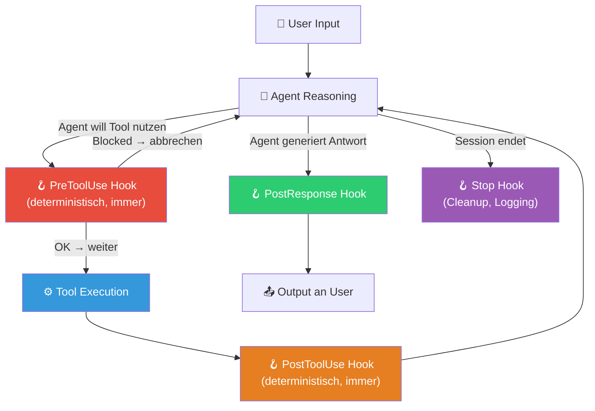

# 🧱 Agent Hooks

**Kategorie:** ai-agents
**Datum:** 2026-03-05
**Quellen:** shanraisshan/claude-code-best-practice, Claude Code Docs, claude-code-voice-hooks
**GitHub:** https://github.com/tricksal/brickbase/tree/main/patterns/ai-agents/agent-hooks

---

## Was ist das?

**Hooks** sind deterministische Scripts, die *außerhalb* des Agentic Loops laufen — automatisch getriggert durch Events wie "Agent will ein Tool benutzen" oder "Agent hat eine Antwort generiert".

Der entscheidende Unterschied zu Tools:

| | Tools | Hooks |
|---|---|---|
| **Aufruf** | Agent entscheidet (non-deterministisch) | System triggert automatisch (deterministisch) |
| **Kontrolle** | Agent-seitig | Entwickler-seitig |
| **Zweck** | Agent erweitert seine Fähigkeiten | Entwickler kontrolliert/überwacht Agent |
| **Zuverlässigkeit** | "Wenn der Agent dran denkt" | Immer, ohne Ausnahme |

Hooks sind der Weg, um **garantierte Seiteneffekte** in einen Agenten einzubauen — egal was der Agent "entscheidet".

---

## Diagramm: Hooks im Agentic Loop



---

## Hook-Typen

| Event | Wann | Typischer Use Case |
|-------|------|--------------------|
| `PreToolUse` | Bevor Agent ein Tool aufruft | Validierung, Logging, Blocking |
| `PostToolUse` | Nach jedem Tool-Call | Ergebnis-Logging, Side Effects |
| `PostResponse` | Nach jeder Agent-Antwort | Audio output, UI-Updates, Analytics |
| `Stop` | Session endet | Cleanup, Memory-Flush, Report |
| `Notification` | Bestimmte Events | Alerts, externe Benachrichtigungen |

---

## Dateistruktur

```
.claude/
└── hooks/
    ├── pre-tool-use.sh          # Läuft vor jedem Tool-Call
    ├── post-tool-use.sh         # Läuft nach jedem Tool-Call
    ├── post-response.py         # Python statt Bash — auch möglich
    └── stop.sh                  # Session-Ende
```

---

## Code-Patterns

### 1. PreToolUse: Gefährliche Befehle blockieren

```bash
#!/bin/bash
# .claude/hooks/pre-tool-use.sh

TOOL_NAME=$1
TOOL_INPUT=$2

# Niemals rm -rf erlauben
if echo "$TOOL_INPUT" | grep -q "rm -rf"; then
    echo "BLOCKED: rm -rf ist verboten!" >&2
    exit 1  # Exit 1 = Tool-Call blockiert
fi

# Niemals außerhalb des Projekt-Verzeichnisses schreiben
if echo "$TOOL_INPUT" | grep -qE "\/etc\/|\/usr\/|\/root\/"; then
    echo "BLOCKED: Schreiben außerhalb des Projekts verboten!" >&2
    exit 1
fi

exit 0  # OK → Tool darf laufen
```

### 2. PostResponse: Automatische Sprachausgabe

```python
#!/usr/bin/env python3
# .claude/hooks/post-response.py
# Quelle: claude-code-voice-hooks

import sys
import json
import subprocess

def speak(text: str):
    """Spricht die Agent-Antwort via TTS vor."""
    # macOS say, oder ElevenLabs, oder OpenAI TTS
    subprocess.run(["say", "-v", "Samantha", text[:200]])  # Max 200 Zeichen

if __name__ == "__main__":
    response_data = json.loads(sys.stdin.read())
    agent_message = response_data.get("message", "")
    
    if agent_message:
        speak(agent_message)
```

### 3. Stop: Memory-Flush am Session-Ende

```python
#!/usr/bin/env python3
# .claude/hooks/stop.py
# Wichtige Infos vor Session-Ende sichern

import sys
import json
from datetime import datetime
from pathlib import Path

def flush_memory(session_data: dict):
    """Schreibt Session-Zusammenfassung in Memory-Bank."""
    memory_dir = Path("memory-bank")
    memory_dir.mkdir(exist_ok=True)
    
    today = datetime.now().strftime("%Y-%m-%d")
    log_file = memory_dir / f"{today}.md"
    
    with open(log_file, "a") as f:
        f.write(f"\n## Session {datetime.now().strftime('%H:%M')}\n")
        for key, value in session_data.items():
            f.write(f"- **{key}:** {value}\n")

if __name__ == "__main__":
    session_data = json.loads(sys.stdin.read())
    flush_memory(session_data)
```

### 4. PostToolUse: Tool-Logging für Audits

```bash
#!/bin/bash
# .claude/hooks/post-tool-use.sh

TOOL_NAME=$1
TOOL_INPUT=$2
TOOL_OUTPUT=$3
TIMESTAMP=$(date -Iseconds)

# Alle Tool-Calls loggen
echo "$TIMESTAMP | $TOOL_NAME | $(echo $TOOL_INPUT | head -c 100)" >> .claude/tool-audit.log

# Bei Write-Operationen: Git-Commit vorschlagen
if [[ "$TOOL_NAME" == "Write" || "$TOOL_NAME" == "Edit" ]]; then
    CHANGED_FILE=$(echo "$TOOL_INPUT" | python3 -c "import sys,json; d=json.load(sys.stdin); print(d.get('path',''))")
    echo "📝 Datei geändert: $CHANGED_FILE" >&2
fi
```

---

## Konfiguration in settings.json

```json
{
  "hooks": {
    "PreToolUse": [
      {
        "matcher": "Bash",
        "hooks": [
          {
            "type": "command",
            "command": ".claude/hooks/pre-tool-use.sh"
          }
        ]
      }
    ],
    "PostResponse": [
      {
        "hooks": [
          {
            "type": "command",
            "command": "python3 .claude/hooks/post-response.py"
          }
        ]
      }
    ],
    "Stop": [
      {
        "hooks": [
          {
            "type": "command",
            "command": "python3 .claude/hooks/stop.py"
          }
        ]
      }
    ]
  }
}
```

---

## Kombination: Hooks + Memory Bank (Cline-Style)

Das ist eine besonders wertvolle Kombination:

```python
# Stop-Hook → automatisch activeContext.md updaten
# Kein manuelles "update memory bank" nötig — läuft immer!

def stop_hook(session_data):
    bank = ContextBank("memory-bank")
    bank.update_active(
        current_focus=session_data.get("last_task"),
        recent_changes=session_data.get("changed_files", []),
        next_steps=session_data.get("todos", [])
    )
```

Mit diesem Pattern läuft die Memory Bank vollautomatisch — der Entwickler muss nie daran denken.

---

## Wann Hooks?

✅ **Einsetzen wenn:**
- Bestimmte Aktionen *garantiert* passieren müssen (Logging, Security-Checks)
- Seiteneffekte außerhalb des Agent-Kontexts nötig (TTS, Notifications, Git)
- Memory-Sync am Session-Ende automatisiert werden soll
- Audit-Trail für alle Tool-Calls gebraucht wird

❌ **Nicht nötig wenn:**
- Einfache Einzel-Tasks ohne Lifecycle-Anforderungen
- Der Agent selbst entscheiden kann/soll (→ dann Tool)
- Einmalige Skripte ohne Wiederholung

---

## Gotchas

### 🚫 Hooks nicht für Reasoning nutzen
Hooks sind deterministisch — sie kennen den Agent-Kontext nicht vollständig. Keine komplexen Entscheidungen im Hook, nur einfache Regeln.

### ⏱️ Hooks müssen schnell sein
Jeder Hook-Call blockiert den Agent. PreToolUse-Hooks < 100ms anstreben.

### 🔐 Exit Codes beachten
- `exit 0` → OK, weiter
- `exit 1` → Abbruch / Blockierung
- `exit 2` → Agent bekommt Fehlermeldung als Tool-Result

---

## Referenzen

| Quelle | Key Contribution |
|--------|-----------------|
| [shanraisshan/claude-code-best-practice](https://github.com/shanraisshan/claude-code-best-practice) | Hooks-Doku + Beispiele |
| [claude-code-voice-hooks](https://github.com/shanraisshan/claude-code-voice-hooks) | TTS PostResponse Hook |
| [Claude Code Hooks Docs](https://code.claude.com/docs/en/hooks) | Offizielle Doku |
| [Brickbase Pattern](https://github.com/tricksal/brickbase/tree/main/patterns/ai-agents/agent-hooks) | Code + README |
