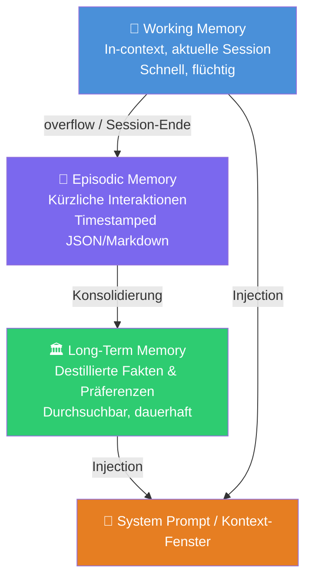

# 🧱 Agent Memory Patterns

**Kategorie:** ai-agents
**Datum:** 2026-03-04
**Quellen:** Mem0, Letta/MemGPT, OpenClaw, OpenCode Agent Memory, Cline Memory Bank
**GitHub:** https://github.com/tricksal/brickbase/tree/main/patterns/ai-agents/agent-memory-patterns

---

## Was ist das?

Wie erinnert sich ein KI-Agent an Dinge — über einzelne Turns, Sessions und Neustarts hinweg?

Das ist eines der fundamentalsten ungelösten Probleme im Agent-Design. LLMs haben keinen persistenten Zustand: Was nicht im Kontext-Fenster steht, existiert nicht. Aber Kontext-Fenster sind begrenzt und teuer.

**Agent Memory Patterns** sind die etablierten Lösungsansätze dafür — von trivial einfach (alles in die System Prompt schreiben) bis hochentwickelt (Hybrid-Vektordatenbanken mit automatischer Konsolidierung).

Die wichtigsten Frameworks sind:
- **Mem0** (42k ⭐) — Multi-Level Memory mit LLM-basierter Extraktion und Hybrid-Retrieval
- **Letta/MemGPT** (19k ⭐) — Hierarchische Blocks + External Storage, Paging-Analogie
- **OpenClaw** — File-based Memory (MEMORY.md) + optionaler Vector Store mit QMD/sqlite-vec
- **opencode-agent-memory** — Letta-inspiriertes Plugin, Named Blocks + Journal
- **Cline Memory Bank** — Strukturiertes Verzeichnis mit semantisch getrennten Dateien + expliziter Session-Sync

---

## Diagramm: Memory-Hierarchie



### Kognitionswissenschaftliche Entsprechungen

| Memory-Typ | Analogie | Beispiel |
|---|---|---|
| Working Memory | RAM / L1-Cache | "User heißt Alice, fragt gerade nach X" |
| Episodic Memory | Tagebuch | "Am 04.03 half ich Alice mit Rate Limiting" |
| Semantic Memory | Lexikon | "Alice bevorzugt asyncio, hasst Java" |
| Procedural Memory | Muskelgedächtnis | "Beim Debuggen: erst Logs prüfen, dann..." |

---

## Die 5 Ansätze im Vergleich

| Approach | Persistence | Scalability | Complexity | Best For |
|---|---|---|---|---|
| **In-Context** | ❌ Session only | ❌ Context limit | ⭐ Trivial | Prototypen, kurze Chats |
| **File-Based** | ✅ Permanent | ⚠️ ~1K Einträge | ⭐⭐ Niedrig | Persönliche Agenten (OpenClaw) |
| **Layered** | ✅ Permanent | ✅ Tausende | ⭐⭐⭐ Mittel | Production Chatbots (Mem0) |
| **Hierarchical Blocks** | ✅ Permanent | ✅ Tausende | ⭐⭐⭐ Mittel | Stateful Coding Agents (Letta) |
| **Vector Memory** | ✅ Permanent | ✅✅ Millionen | ⭐⭐⭐⭐ Hoch | RAG-heavy, große Wissensbases |
| **Structured Context Bank** | ✅ Permanent | ⚠️ Projektgröße | ⭐⭐ Niedrig | Coding Agents, iterative Projekte (Cline) |

---

## Deep-Dive: File-Based Memory (praktischster Einstieg)

### Das Prinzip

Der Agent schreibt in Markdown-Dateien und liest daraus. Human-readable, auditierbar, keine externen Dependencies.

**OpenClaw's Implementierung:**
- `MEMORY.md` — Kuriertes Langzeit-Gedächtnis (nur in der Haupt-Session laden!)
- `memory/YYYY-MM-DD.md` — Tages-Logs (append-only)
- Pre-Compaction Flush: Kurz vor dem Context-Compaction wird ein stiller Turn getriggert, der den Agenten auffordert, wichtige Infos zu speichern
- Optional: Vector-Index über alle .md-Dateien (sqlite-vec + BM25 hybrid)

**opencode-agent-memory's Implementierung:**
- Named "Memory Blocks" mit Scope (global / project)
- Tools: `memory_list`, `memory_set`, `memory_replace`
- Journal: Append-only Einträge mit semantischer Suche (lokal, kein Cloud-API nötig)
- Blocks erscheinen immer in der System Prompt (always in-context)

### Code-Pattern

```python
from core import SimpleFileMemory

mem = SimpleFileMemory("MEMORY.md")

# Schreiben (nach Session)
mem.write("user_name", "Alice")
mem.write("preferences", "Concise answers, Python examples preferred")

# Lesen (beim Session-Start)
system_prompt = f"## Memory\n{mem.dump()}"

# Suchen (für relevanten Kontext)
results = mem.search("Python asyncio")
```

### Wann reicht File-Based Memory?

- ✅ Persönliche Agenten (1 User)
- ✅ < 500 Memory-Einträge
- ✅ Keyword-Suche ausreichend
- ✅ Human-Lesbarkeit wichtig
- ❌ Multi-User (Privacy-Problem ohne Scope)
- ❌ > 1000 Einträge (Performance)
- ❌ Semantische Ähnlichkeitssuche gebraucht

---

## Deep-Dive: Layered Memory (Mem0-Style)

### Das Prinzip

Drei Tiers mit automatischer Promotion:

```
Working Memory (RAM)
    ↓ Session-Ende / Overflow
Episodic Memory (Tagebuch)
    ↓ Konsolidierung (periodisch)
Long-Term Memory (Fakten-Base)
    ↓ Injection
System Prompt
```

**Mem0's Ansatz:**
- LLM extrahiert automatisch wichtige Fakten aus Konversationen
- Hybrid: Vektor-Embeddings + Knowledge Graph
- Multi-Level: User Memory / Agent Memory / Session Memory
- +26% Accuracy vs OpenAI Memory (LOCOMO Benchmark)
- 91% schneller als Full-Context, 90% weniger Tokens

**Letta/MemGPT's Ansatz:**
- "In-Context Memory Blocks" — immer sichtbar (wie fixiertes RAM)
- "Archival Storage" — externe Datenbank, durchsucht auf Anfrage
- Agent kann seine eigenen Blocks editieren (self-editing memory)
- OS-Paging Analogie: Wichtiges im RAM, Rest auf Disk

### Code-Pattern

```python
from core import LayeredMemory

mem = LayeredMemory("./agent_memory")

# Während der Session
mem.remember("User fragt nach Rate Limiting", tier="episodic", importance=0.4)
mem.remember("User bevorzugt asyncio", tier="long_term", importance=0.9, tags=["preference"])

# Recall über alle Tiers
results = mem.recall("asyncio threading")

# Session beenden
mem.end_session()   # Working → Episodic
mem.consolidate()   # wichtige Episodic → Long-Term (importance >= 0.7)
```

### Die Stärke: Automatische Konsolidierung

```python
# Mem0 macht das automatisch mit einem LLM:
memory.add(conversation_messages, user_id="alice")
# Intern: LLM extrahiert Fakten, dedupliziert, löst Widersprüche auf

# Letta macht das über Self-Editing Tools:
# Der Agent ruft memory_replace() auf, wenn er wichtiges lernt
```

---

## Deep-Dive: Structured Context Bank (Cline Memory Bank-Style)

### Das Prinzip

Kein monolithisches Memory-File, sondern ein **Verzeichnis mit semantisch getrennten Dateien** — jede Datei hat einen klar definierten Zweck. Der Agent liest alles beim Session-Start und schreibt am Ende (oder bei Meilensteinen) zurück. Popularisiert durch [Cline](https://github.com/cline/cline)'s Memory Bank Feature.

Der entscheidende Unterschied zu einfachem File-Based Memory: Es gibt eine **dedizierte `activeContext.md`**, die *genau das* enthält, woran gerade gearbeitet wird — aktuelle Änderungen, nächste Schritte, offene Fragen. Das ist der operative Live-Zustand des Projekts, keine Langzeit-Erinnerung.

### Dateistruktur

```
memory-bank/
├── projectbrief.md      # Core requirements & goals — Fundament, selten geändert
├── productContext.md    # Zweck, Probleme, UX-Ziele — Strategische Ebene
├── activeContext.md     # ← DAS HERZ: aktueller Fokus, letzte Änderungen, nächste Schritte
├── systemPatterns.md    # Architektur, Design Patterns, Komponenten-Beziehungen
├── techContext.md       # Tech Stack, Setup, Dependencies, Constraints
└── progress.md          # Status, Milestones, bekannte Issues
```

### Session-Lifecycle

```
Session START
    └─ Agent liest alle Dateien in memory-bank/
    └─ Agent kennt: Was ist das Projekt? Wo stehen wir? Was kommt als nächstes?

During Session
    └─ Agent arbeitet, ändert Code, löst Probleme
    └─ (Optional: bei größeren Änderungen zwischendurch updaten)

Session END / Meilenstein
    └─ "update memory bank" → Agent reviewed + refresht alle Dateien
    └─ Wichtigste Datei: activeContext.md (Fokus, letzte Änderungen, nächste Schritte)
```

### Code-Pattern

```python
import os
from pathlib import Path

class ContextBank:
    """Cline Memory Bank-Style: semantisch getrennte Dateien, Session-Sync."""
    
    FILES = {
        "brief": "projectbrief.md",       # Stabil, selten ändern
        "context": "productContext.md",    # Strategisch
        "active": "activeContext.md",      # ← Täglich aktualisieren!
        "patterns": "systemPatterns.md",  # Architektur-Wissen
        "tech": "techContext.md",         # Stack & Setup
        "progress": "progress.md",        # Status-Tracking
    }
    
    def __init__(self, root="memory-bank"):
        self.root = Path(root)
        self.root.mkdir(exist_ok=True)
    
    def load_all(self) -> dict[str, str]:
        """Session-Start: Alle Dateien laden → System Prompt."""
        return {
            key: (self.root / fname).read_text()
            for key, fname in self.FILES.items()
            if (self.root / fname).exists()
        }
    
    def to_system_prompt(self) -> str:
        """Fertig für System Prompt."""
        sections = self.load_all()
        return "\n\n".join(
            f"## {key.upper()}\n{content}"
            for key, content in sections.items()
        )
    
    def update_active(self, current_focus: str, recent_changes: list[str], next_steps: list[str]):
        """Das Wichtigste: activeContext nach jeder Session aktualisieren."""
        content = f"""# Active Context

## Current Focus
{current_focus}

## Recent Changes
{chr(10).join(f'- {c}' for c in recent_changes)}

## Next Steps
{chr(10).join(f'- {s}' for s in next_steps)}

_Updated: {__import__('datetime').date.today()}_
"""
        (self.root / self.FILES["active"]).write_text(content)
    
    def update_progress(self, done: list[str], in_progress: list[str], issues: list[str]):
        """Progress-Datei nach Meilensteinen updaten."""
        content = f"""# Progress

## Done
{chr(10).join(f'- ✅ {d}' for d in done)}

## In Progress
{chr(10).join(f'- 🔄 {p}' for p in in_progress)}

## Known Issues
{chr(10).join(f'- ⚠️ {i}' for i in issues)}

_Updated: {__import__('datetime').date.today()}_
"""
        (self.root / self.FILES["progress"]).write_text(content)


# Verwendung
bank = ContextBank()

# Session-Start: System Prompt bauen
system = bank.to_system_prompt()

# Session-Ende: Aktiven Kontext updaten
bank.update_active(
    current_focus="Implementing auth middleware",
    recent_changes=["Added JWT validation", "Refactored user model"],
    next_steps=["Write tests for auth flow", "Update API docs"]
)
```

### Was Cline einzigartig macht vs. simples File-Based Memory

| Aspekt | Einfaches File-Based (MEMORY.md) | Cline Memory Bank |
|--------|----------------------------------|-------------------|
| Struktur | Ein großes Blob-Dokument | Semantisch getrennte Dateien |
| Fokus | Langzeit-Fakten & Präferenzen | Auch: aktueller Arbeitsstand |
| `activeContext` | ❌ Fehlt | ✅ Kern-Feature |
| Update-Rhythmus | Episodisch (Session-Ende) | Explizit nach Meilensteinen |
| Human-Lesbarkeit | ✅ | ✅✅ Noch klarer |
| Für Coding Agents | ⚠️ Suboptimal | ✅ Ideal |

### Wann verwenden?

- ✅ Coding Agents (Claude Code, Cline, Cursor) — für iterative Projekt-Arbeit
- ✅ Wenn mehrere Personen/Agenten am gleichen Projekt arbeiten
- ✅ Wenn der "aktuelle Fokus" wichtig ist, nicht nur Langzeit-Fakten
- ✅ Projekte über Wochen/Monate mit häufigen Session-Wechseln
- ❌ Persönliche Assistenten (zu viel Overhead für 1:1-Gespräche)
- ❌ Kurzlebige Agenten (Setup-Aufwand lohnt sich nicht)

---

## Wann welchen Ansatz?

```
Brauche ich Persistenz über Sessions?
├── Nein → In-Context Memory
└── Ja  → Wie viele Memories erwarte ich?
           ├── < 500  → File-Based Memory (SimpleFileMemory)
           └── > 500  → Brauche ich semantische Suche?
                         ├── Nein → Layered Memory (LayeredMemory)
                         └── Ja  → Vector Memory (Mem0) oder
                                    Layered + Embeddings
```

**Für Coding Agents** (wie Claude Code, Cline, Cursor): **Structured Context Bank (Cline Memory Bank)** — semantisch getrennte Dateien mit dedizierter `activeContext.md` für den operativen Arbeitsstand. Hierarchical Blocks (Letta) als Alternative, wenn der Agent seine eigenen Memory-Blocks editieren soll.

**Für persönliche Assistenten** (wie OpenClaw/Botto): File-Based + optionaler Vector-Index — pragmatisch, human-readable, gut debuggbar.

**Für Production Chatbots** (Customer Support, Healthcare): Mem0 — automatische Extraktion, Multi-User, skalierbar.

---

## Gotchas & Learnings

### 🚨 Memory Pollution ist real
Alte, falsche Memories degradieren die Agent-Qualität. Mem0 löst das mit LLM-basierter Konfliktauflösung. Für File-Based: regelmäßige Review + TTL.

### 🔍 Retrieval > Storage
90% des Wertes kommt aus *gutem Retrieval*, nicht Speicherung. Keyword-Suche reicht oft für < 1000 Memories. Vectors nur wenn nötig.

### 📏 Context Window Tax
Jedes Byte injizierter Memory kostet Tokens. OpenClaw nutzt MMR Re-Ranking (Diversity) und Temporal Decay (Recency-Boost), um relevante, nicht-redundante Snippets zu selektieren.

### 🔄 Konsolidierung ist kritisch
Ohne periodische Konsolidierung wächst Memory unbegrenzt. Bei OpenClaw: Pre-Compaction Flush triggert automatisch. Bei Layered Memory: `consolidate()` regelmäßig aufrufen.

### 🔐 Privacy Boundary
Memory-Dateien enthalten sensible User-Daten. Scope-Regeln anwenden: OpenClaw hat `MEMORY.md` nur in der Haupt-Session (nie in Gruppenräumen). Letta isoliert per Agent-ID.

### ⚡ Hybrid Search gewinnt
Vector-only verpasst exakte Tokens (IDs, Code-Symbole, Error-Strings). BM25-only verpasst Paraphrasen. Hybrid ist der Kompromiss: Mem0 und OpenClaw implementieren beide Hybrid-Retrieval.

### 🤖 Self-Editing ist mächtig — und gefährlich
Letta-style Self-Editing ermöglicht dem Agenten, sein eigenes Gedächtnis zu aktualisieren. Risk: Halluzinierte oder überschriebene Memories. Immer mit Human-Oversight oder Versioning absichern.

---

## Referenzen

| Quelle | Key Contribution |
|---|---|
| [Mem0 GitHub](https://github.com/mem0ai/mem0) | Multi-Level Memory, +26% Accuracy, Hybrid Retrieval |
| [Letta/MemGPT GitHub](https://github.com/letta-ai/letta) | Hierarchical Blocks, Self-Editing, OS-Paging |
| [opencode-agent-memory](https://github.com/joshuadavidthomas/opencode-agent-memory) | Named Blocks + Journal, praktisches Plugin |
| [OpenClaw Memory Docs](https://openclaw.dev/docs/concepts/memory) | MEMORY.md-Pattern, Vector Search, MMR, Temporal Decay |
| [MemGPT Paper (arXiv)](https://arxiv.org/abs/2310.08560) | Originalpaper Hierarchical Memory |
| [Mem0 Research](https://mem0.ai/research) | LOCOMO Benchmark, Production Results |
| [Cline Memory Bank](https://github.com/cline/cline) | Structured Context Bank, activeContext.md, Session-Sync |
| [Brickbase Pattern](https://github.com/tricksal/brickbase/tree/main/patterns/ai-agents/agent-memory-patterns) | Code + README |
