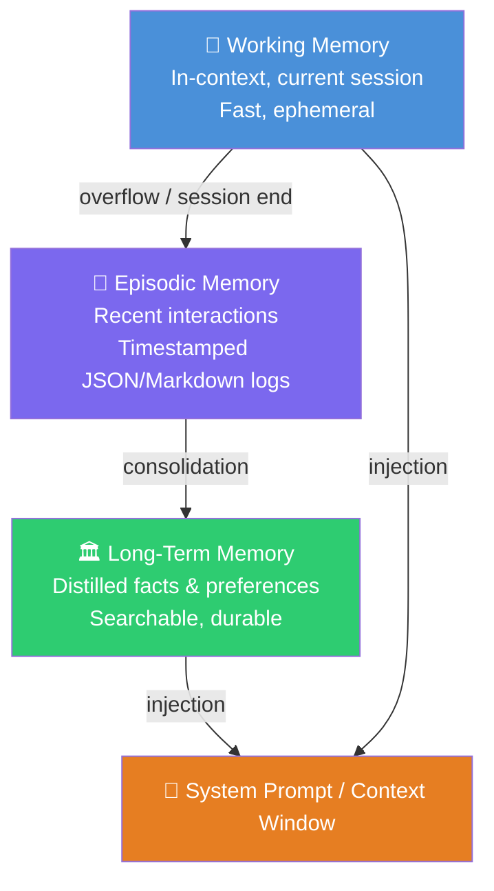
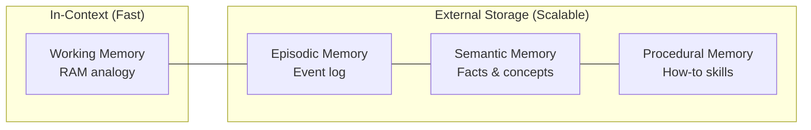

# 🧱 Agent Memory Patterns

> **Brickbase Pattern** — Reusable building blocks for AI agents  
> Category: `ai-agents` | Difficulty: ⭐⭐ Medium

How do AI agents remember things across turns, sessions, and restarts? This pattern distills the key approaches from production agent frameworks (Mem0, Letta/MemGPT, OpenClaw, OpenCode Agent Memory) into practical, copy-paste-ready implementations.

---

## Memory Hierarchy



### Memory Types (Cognitive Science Mapping)



---

## The 5 Approaches Compared

| Approach | Persistence | Scalability | Complexity | Best For |
|---|---|---|---|---|
| **In-Context Memory** | ❌ Session only | ❌ Context limit | ⭐ Trivial | Short conversations, prototypes |
| **File-Based Memory** | ✅ Permanent | ⚠️ ~1K entries | ⭐⭐ Low | Personal agents, OpenClaw-style |
| **Layered Memory** | ✅ Permanent | ✅ Thousands | ⭐⭐⭐ Medium | Production chatbots (Mem0-style) |
| **Hierarchical Blocks** | ✅ Permanent | ✅ Thousands | ⭐⭐⭐ Medium | Stateful coding agents (Letta) |
| **Vector Memory** | ✅ Permanent | ✅✅ Millions | ⭐⭐⭐⭐ High | RAG-heavy, large knowledge bases |

---

## Quick Decision Guide

```
Need memory to persist across sessions?
├── No  → In-Context Memory (just use conversation history)
└── Yes → Will you have > 1000 memories?
           ├── No  → File-Based Memory (simplest, zero deps)
           └── Yes → Do you need semantic search?
                      ├── No  → Layered Memory (structured tiers)
                      └── Yes → Vector Memory or Layered + embeddings
```

---

## Approach 1: In-Context Memory

The simplest approach: keep everything in the system prompt or conversation history.

```python
system_prompt = """
You are a helpful assistant.

## What you know about the user:
- Name: Alice
- Prefers Python examples
- Working on a recipe app

## Recent conversation summary:
- Discussed vector databases on 2026-03-01
"""
```

**When to use:** Prototypes, short-lived sessions, ≤ a few hundred facts.  
**Limitation:** Context window fills up; no persistence across sessions.

---

## Approach 2: File-Based Memory (MEMORY.md pattern)

Agent reads and writes a Markdown file. Human-readable, auditable, zero deps.

```python
from core import SimpleFileMemory

mem = SimpleFileMemory("MEMORY.md")
mem.write("user_name", "Alice")
mem.write("preferences", "Concise answers, code examples preferred")

# At session start, inject into system prompt:
system_prompt = f"## Memory\n{mem.dump()}"

# Search for relevant context:
results = mem.search("Python")
```

**Used by:** OpenClaw (MEMORY.md + daily notes), opencode-agent-memory (named blocks).  
**Gotcha:** Grows unbounded — add a consolidation/pruning step.

---

## Approach 3: Layered Memory (Mem0-style)

Three tiers: Working → Episodic → Long-Term. Inspired by Mem0's multi-level approach.

```python
from core import LayeredMemory

mem = LayeredMemory("./agent_memory")

# During session:
mem.remember("User asked about rate limiting", tier="episodic", importance=0.5)
mem.remember("User prefers asyncio over threads", tier="long_term", importance=0.9, tags=["preference"])

# Recall across all tiers:
results = mem.recall("asyncio threading preferences")

# End of session:
mem.end_session()      # flush working → episodic
mem.consolidate()      # promote high-importance episodic → long-term
```

**Used by:** Mem0 (+26% accuracy over OpenAI Memory, 91% faster than full-context).  
**Gotcha:** Consolidation logic needs tuning — importance thresholds matter.

---

## Approach 4: Hierarchical Blocks (Letta-style)

Named in-context blocks + external storage. Agent can self-edit its own memory.

```python
# Letta memory_blocks (via API):
agent = client.agents.create(
    memory_blocks=[
        {"label": "human", "value": "Name: Alice. Prefers Python."},
        {"label": "persona", "value": "I am a helpful coding assistant."},
        {"label": "project", "value": "Recipe app — FastAPI + PostgreSQL"},
    ]
)

# Agent can call tools to update its own blocks mid-conversation:
# memory_replace("human", "Alice", "Alice (senior Python dev)")
```

**Used by:** Letta/MemGPT, opencode-agent-memory (`memory_set`, `memory_replace` tools).  
**Key insight:** The OS paging analogy — important facts in RAM (context), rest on disk.

---

## Approach 5: Vector Memory

Embedding-based semantic search over large memory stores.

```python
# With Mem0:
from mem0 import Memory
memory = Memory()

memory.add("User prefers Python and dislikes Java", user_id="alice")
results = memory.search("programming language preferences", user_id="alice")

# With custom embeddings (e.g. sentence-transformers):
from sentence_transformers import SentenceTransformer
import numpy as np

model = SentenceTransformer('all-MiniLM-L6-v2')
memories = ["Alice likes Python", "Alice is building a recipe app"]
embeddings = model.encode(memories)

query_emb = model.encode(["python preferences"])
scores = np.dot(embeddings, query_emb.T).flatten()
best = memories[scores.argmax()]
```

**Used by:** Mem0 (vector + graph hybrid), OpenClaw (sqlite-vec + BM25 hybrid), OpenCode Agent Memory (all-MiniLM-L6-v2).  
**Gotcha:** Needs embedding infrastructure; exact-match queries are better served by BM25.

---

## Code: Two Implementations

See [`core.py`](./core.py) for two production-ready implementations:

- **`SimpleFileMemory`** — File-based, zero deps, immediate practical use
- **`LayeredMemory`** — Three-tier (Working/Episodic/Long-Term), no external deps

```bash
python core.py  # runs both demos
```

---

## Gotchas & Learnings

### 🚨 Memory Pollution
Old, incorrect memories degrade agent quality. Implement TTL (time-to-live) and importance thresholds. Mem0 uses an LLM to auto-resolve contradictions.

### 🔍 Retrieval > Storage
90% of the value is in *retrieval*, not storage. Keyword search is often sufficient for < 1000 memories; add vectors when you need semantic search.

### 📏 Context Window Tax
Every byte of injected memory costs tokens. OpenClaw uses MMR re-ranking and temporal decay to keep injected context relevant and non-redundant.

### 🔄 Consolidation is Critical
Without periodic consolidation (episodic → long-term), memory grows unbounded and retrieval degrades. Schedule consolidation at session end or via cron.

### 🔐 Privacy Boundary
Memory files contain sensitive user data. Apply scope rules (OpenClaw's `memory.qmd.scope`) to prevent leaking private context across group chats or sessions.

### ⚡ Hybrid Search Wins
Vector-only misses exact tokens (IDs, code symbols). BM25-only misses paraphrases. Use both: Mem0 and OpenClaw both implement hybrid retrieval.

---

## References

| Source | Key Contribution |
|---|---|
| [Mem0](https://github.com/mem0ai/mem0) | Multi-level memory, +26% accuracy vs OpenAI Memory, hybrid retrieval |
| [Letta/MemGPT](https://github.com/letta-ai/letta) | Hierarchical blocks, self-editing, OS paging analogy |
| [opencode-agent-memory](https://github.com/joshuadavidthomas/opencode-agent-memory) | Named blocks + journal, practical plugin implementation |
| [OpenClaw Memory Docs](https://github.com/tricksal/brickbase) | MEMORY.md pattern, vector search, hybrid BM25+vector, MMR, temporal decay |
| [MemGPT Paper](https://arxiv.org/abs/2310.08560) | Original hierarchical memory paper |
| [Mem0 Research](https://mem0.ai/research) | LOCOMO benchmark results |
