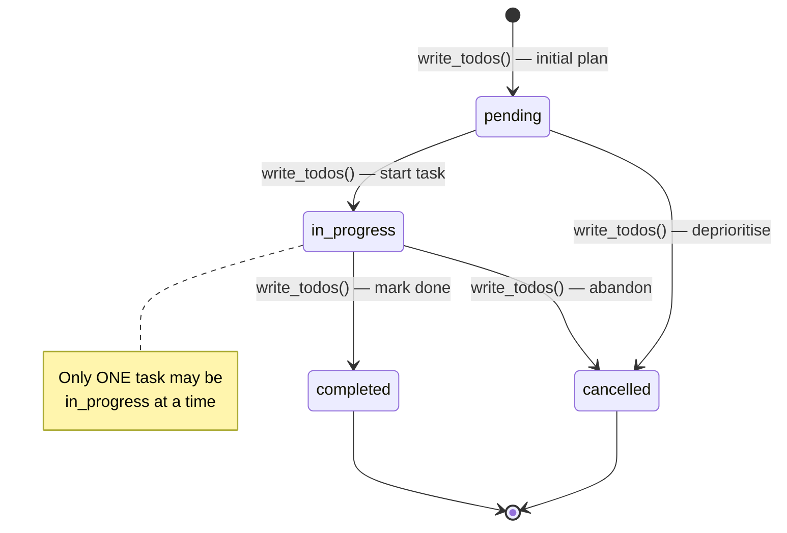
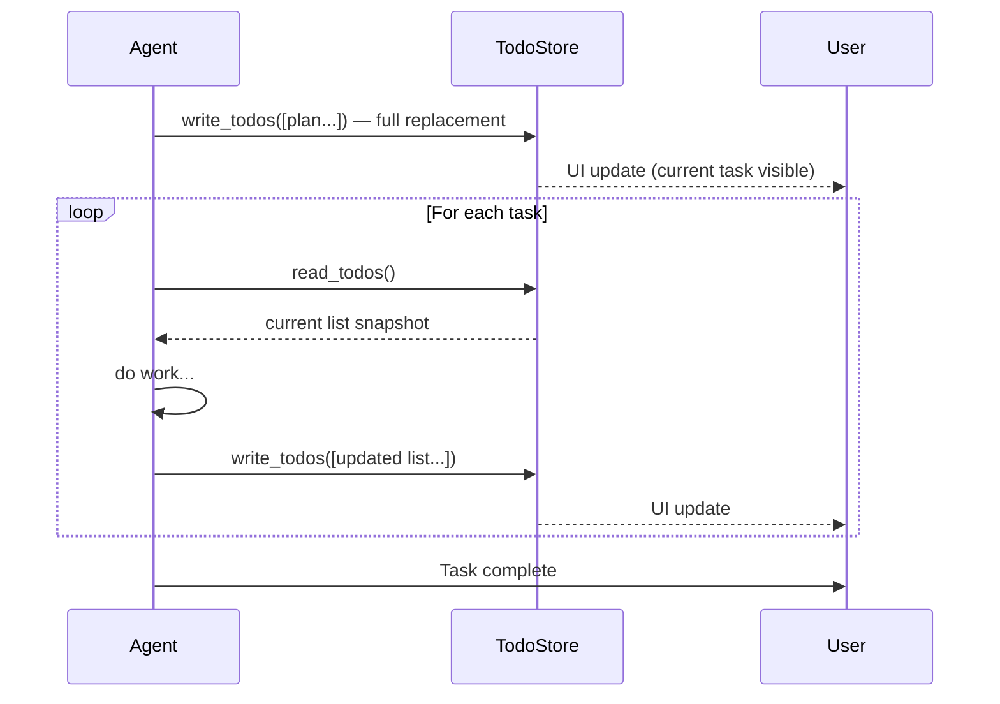

# 🧱 Agent Todo List

**Category:** ai-agents  
**Status:** Stable  
**Sources:** Pi Agent (mariozechner), Gemini CLI, Claude Code  

A design pattern for giving AI agents explicit, inspectable task management — breaking complex goals into a live, updateable todo list that keeps the agent on track and users informed.

---

## What is it?

An **Agent Todo List** is a structured in-session task tracker that an AI agent creates and maintains throughout a complex multi-step task. Unlike internal chain-of-thought, it is:

- **Visible** to the user (rendered in the UI, shown in context)
- **Mutable** — the agent updates it as work progresses
- **Enforced** — constraints like "only one in-progress task at a time" prevent drift

It solves the classic agent failure mode: losing track of the overall goal while executing a subtask.

---

## Task Lifecycle (Mermaid)





---

## Design Decisions Compared

| Dimension | Pi Agent (mariozechner) | Gemini CLI | Claude Code |
|-----------|------------------------|------------|-------------|
| **Core innovation** | State reconstructed from session history | Full list replacement on every write | Explicit read-before-write tandem |
| **Storage** | Tool result `details` in session entries | In-memory + UI overlay | File-based (per-session) |
| **Update model** | Delta (add / toggle / clear actions) | Full replacement (no delta) | Full replacement |
| **Branching** | ✅ Automatic (state follows session branch) | ❌ Not addressed | ❌ Not addressed |
| **Concurrency** | ✅ Branch-safe by design | ⚠️ Single agent assumed | ⚠️ Single agent assumed |
| **API surface** | `todo(action, text?, id?)` — multi-action | `write_todos(todos[])` — single op | `TodoRead()` + `TodoWrite(todos[])` |
| **Read discipline** | Implicit (state in memory) | None explicit | ✅ Enforced: must call TodoRead first |
| **In-progress limit** | ❌ Not enforced | ✅ "Only one in_progress" | ✅ "Only one in_progress" |
| **User visibility** | `/todos` command overlay | `Ctrl+T` toggle + inline display | Terminal sidebar |
| **Best for** | Branching chat sessions, interactive TUIs | Single-session linear tasks | Long-running coding tasks |

### Winner by dimension

- **Branching** → Pi Agent (state-from-session is genius)
- **Simplicity** → Gemini (one tool, full replacement, done)
- **Discipline** → Claude Code (read-before-write catches stale state bugs)

---

## How It Works

### Full Replacement Model (recommended)

The key insight from Gemini: **never do delta updates**. Always replace the entire list.

```python
# ❌ Delta approach — error-prone
todos.add("New task")
todos.complete(3)
todos.remove(5)

# ✅ Full replacement — simple, reliable
todos.write([
    Todo("Research", status="completed"),
    Todo("Implement", status="in_progress"),
    Todo("Test", status="pending"),
])
```

Why full replacement wins:
- No partial-update bugs
- No "what if the agent missed a prior delta?" edge cases  
- The complete desired state is always explicit
- Easy to audit / debug

### Read Before Write

```python
# Agent pattern (Claude Code style)
current = read_todos()          # always read first
updated = advance(current)      # compute new state
write_todos(updated)            # replace full list
```

This catches bugs where a second concurrent agent or a UI interaction changed the list between planning and execution.

### State-from-Session (Pi Agent's contribution)

Instead of a separate file or database, store the full todo list in the **tool result metadata** of each tool call. When the session branches (user forks the conversation), the todo state automatically follows the correct branch — no synchronisation needed.

```typescript
// Every tool call returns the full current state in `details`
return {
    content: [{ type: "text", text: "Added task" }],
    details: { todos: [...todos], nextId } // ← state snapshot
}

// On branch/fork: replay tool results to reconstruct state
for (const entry of session.getBranch()) {
    if (entry.toolName === "todo") {
        todos = entry.details.todos
    }
}
```

---

## When to Use

✅ **Good fit:**
- Multi-step coding tasks (research → design → implement → test)
- Tasks that take >3 tool calls to complete
- When you want the user to see current progress
- Agentic sessions where the LLM might lose focus

❌ **Skip it when:**
- Simple single-turn requests ("fix this typo")
- Tasks with no meaningful subtasks
- Streaming responses where overhead matters

---

## Gotchas & Learnings

### 1. Enforce the single in-progress constraint
Models (especially larger ones) sometimes mark two tasks in-progress simultaneously. Validate server-side and reject with an error.

### 2. Full replacement requires the agent to "carry" the whole list
The agent's context must include the current list before every update. This costs tokens but prevents divergence.

### 3. Don't use todos for micro-tasks
If a task takes one tool call, it doesn't need a todo entry. Todos are for phases, not actions.

### 4. Status `cancelled` is important
Agents should be able to cancel tasks, not just complete them. This communicates intent to the user ("I decided not to do X because...").

### 5. IDs should be stable within a session
Don't reassign IDs on every write. The agent and user both reference tasks by ID in conversation.

### 6. For branching sessions: store state in tool results
If your agent framework supports conversation branching, the Pi Agent approach (state-from-session-history) is far more robust than any external storage.

---

## Usage Example

```python
from core import TodoList, Todo, Status, make_agent_tools

# Setup
todos = TodoList()
read_todos, write_todos = make_agent_tools(todos)

# Agent creates plan
write_todos([
    {"description": "Analyse requirements", "status": "in_progress"},
    {"description": "Write implementation",  "status": "pending"},
    {"description": "Run tests",             "status": "pending"},
])

# Agent finishes first task, starts next
current = read_todos()
write_todos([
    {**t, "status": "completed"} if t["description"] == "Analyse requirements"
    else {**t, "status": "in_progress"} if t["description"] == "Write implementation"
    else t
    for t in current["todos"]
])
```

---

## References

- Pi Agent todo extension: `@mariozechner/pi-coding-agent/examples/extensions/todo.ts`
- Gemini CLI docs: `@google/gemini-cli-core/dist/docs/tools/todos.md`
- Claude Code: [Anthropic docs — TodoWrite/TodoRead](https://docs.anthropic.com/en/docs/claude-code)
- sst/opencode: `packages/opencode/src/tool/` (todowrite.ts, todoread.ts)
- Brickbase: https://github.com/tricksal/brickbase/tree/main/patterns/ai-agents/agent-todo-list
