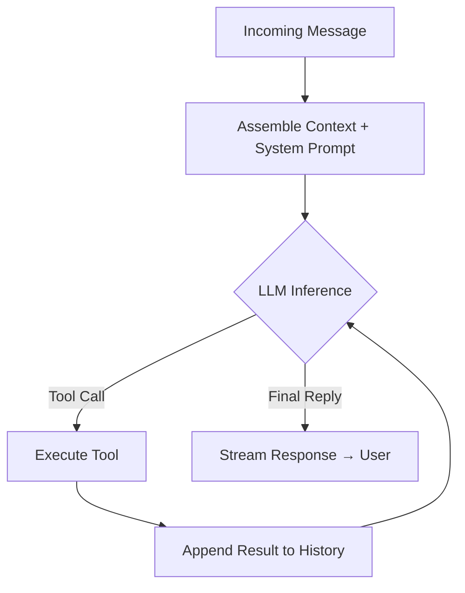

# agent-tool-loop

## What
An LLM agent runs in a loop: call a tool → process result → call next tool → … → produce final reply.

## When to use
- Any task where an LLM needs multiple sequential steps to reach an answer
- When tool results influence which tool to call next (dynamic branching)
- Code-write → test → fix loops
- Web-search → read → follow-up-search pipelines
- As the foundational structure for any autonomous AI agent

## Diagram



## Core concept

The model never sees the full execution plan upfront. It receives the conversation
history (including all prior tool results), decides what to do next, and either:
- calls another tool (loop continues), or
- produces a text reply (loop ends).

The termination condition is implicit: the loop ends when the model stops calling tools.
A hard iteration cap prevents infinite loops.

```
user message
    ↓
[model inference]
    ↓ tool call? ──yes──> execute tool ──> append result ──> [model inference again]
    ↓ no
final reply
```

Session history is serialised per session (queue) to prevent race conditions when
multiple requests arrive for the same agent.

## Dependencies
- `openai` (or any OpenAI-compatible SDK)
- `pip install openai`

## Usage
```python
from openai import OpenAI
from core import AgentToolLoop, AgentLoopConfig, Tool

client = OpenAI(api_key="...")

def get_weather(city: str) -> dict:
    return {"city": city, "temp_c": 18}

tools = [
    Tool(
        name="get_weather",
        description="Get current weather for a city.",
        parameters={
            "type": "object",
            "properties": {"city": {"type": "string"}},
            "required": ["city"],
        },
        fn=get_weather,
    )
]

agent = AgentToolLoop(client=client, tools=tools, config=AgentLoopConfig())
print(agent.run("What's the weather in Berlin?"))
```

## Key implementation notes
- `max_iterations` is a required safety cap — without it, a confused model can loop forever
- Tool results are JSON-serialised and appended as `role: "tool"` messages
- `NO_REPLY` token convention: model signals "don't send this to the user"
- Hook points (before/after tool call) are ideal for logging, sanitising, and policy enforcement

## Source
- OpenClaw docs: `docs/concepts/agent-loop.md`
- Extracted: 2026-03-04
