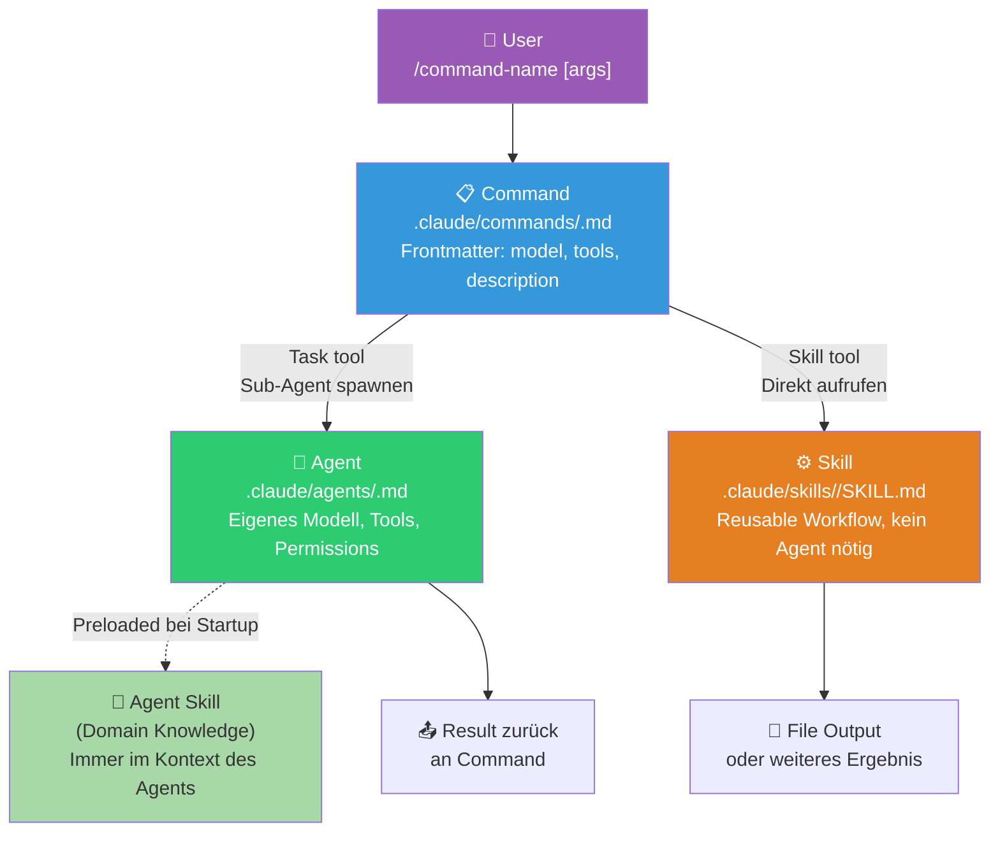

# 🧱 Command-Skill Orchestration

**Kategorie:** ai-agents
**Datum:** 2026-03-05
**Quellen:** shanraisshan/claude-code-best-practice, Boris Cherny (Anthropic), OpenClaw Skills
**GitHub:** https://github.com/tricksal/brickbase/tree/main/patterns/ai-agents/command-skill-orchestration

---

## Was ist das?

Ein **Command** ist ein deklarativer Entry-Point: eine Markdown-Datei mit YAML-Frontmatter, die einen Workflow startet, Agents delegiert und Skills aufruft — ohne eine Zeile Python.

Das Muster: **Command → Agent (mit preloaded Skill) → Skill**

```
User tippt: /fix-issue 42
      ↓
Command (Entry Point, haiku)
      ↓ Task tool
   Agent (sonnet) ← preloaded Skill als Domain-Wissen
      ↓ Returns Ergebnis
Command ruft Skill auf
      ↓ Skill tool
   Skill (standalone, erzeugt Output)
```

Der Schlüssel: Commands sind *Orchestratoren*, keine Implementierungen. Sie wählen das richtige Modell, delegieren Arbeit, und verbinden alles.

---

## Diagramm: Orchestration Flow



---

## Command: Frontmatter & Syntax

Commands liegen in `.claude/commands/<name>.md`:

```markdown
---
description: Fix a GitHub issue by number, following team standards
argument-hint: [issue-number]
allowed-tools: Read, Write, Edit, Bash, Task
model: sonnet
---

Fix GitHub issue #$ARGUMENTS.

1. Read the issue with `gh issue view $0`
2. Spawn a sub-agent to implement the fix: Task(fix-agent)
3. Run tests: !`npm test`
4. Create PR if tests pass
```

### Alle Frontmatter-Felder

| Feld | Typ | Beschreibung |
|------|-----|-------------|
| `description` | string | Wofür dieser Command ist — erscheint im Autocomplete |
| `argument-hint` | string | Hint beim Tippen: z.B. `[issue-number]`, `[filename]` |
| `allowed-tools` | string | Tools ohne Permission-Prompt, kommasepariert |
| `model` | string | Modell für diesen Command: `haiku`, `sonnet`, `opus` |

### String Substitutions

| Variable | Beschreibung |
|----------|-------------|
| `$ARGUMENTS` | Alle übergebenen Argumente als String |
| `$ARGUMENTS[N]` | Argument N (0-basiert) |
| `$N` | Kurzform: `$0`, `$1`, etc. |
| `${CLAUDE_SESSION_ID}` | Aktuelle Session-ID |
| `` !`shell-cmd` `` | **Dynamic Injection** — Shell-Output wird *vor* Claude-Verarbeitung eingefügt |

Dynamic Injection ist mächtig:
```markdown
Analysiere diese Codebase:
!`find . -name "*.py" | head -20`
!`git log --oneline -5`
```
Claude sieht den Shell-Output, nicht den Befehl.

---

## Zwei Arten von Skills

Das ist der subtile, aber wichtige Unterschied:

### Agent Skills (preloaded)
```yaml
# .claude/agents/weather-agent.md
name: weather-agent
skills:
  - weather-fetcher   # ← wird beim Agent-Start in den Kontext geladen
model: sonnet
```
- Der Skill ist **immer im Kontext** des Agents — wie ein Lehrbuch, das der Agent permanent aufgeschlagen hat
- Kein separater Tool-Call nötig
- Gut für: Domain-Wissen, das der Agent *immer* braucht

### Skills (invoked)
```markdown
<!-- In Command oder Agent -->
Rufe den Skill auf: Skill(weather-svg-creator)
```
- Wird **on-demand** geladen, wenn gebraucht
- Gut für: Spezifische Aufgaben, die nur manchmal relevant sind
- Spart Kontext-Tokens

### Wann welche?

| Situation | Empfehlung |
|-----------|-----------|
| Agent braucht Expertise *immer* (z.B. Code Style Guide) | Agent Skill (preloaded) |
| Task nur gelegentlich nötig | Skill (invoked) |
| Wiederverwendung über viele Contexts | Skill (invoked) |
| Spezialisierter Agent für ein Thema | Agent Skill (preloaded) |

---

## Model-Strategie: Richtiges Modell pro Schicht

Das ist einer der größten Hebel für Kosten und Qualität:

```
Command (Entry Point)        → haiku   (günstig, nur Orchestrierung)
Agent (komplexe Analyse)     → sonnet  (balanciert)
Kritische Code-Entscheidung  → opus    (teuer, nur wenn nötig)
Skill (einfacher Output)     → haiku   (günstig)
```

**Faustregel:** So billig wie möglich, so gut wie nötig. Nur für den Teil, der wirklich Reasoning braucht, teureres Modell einsetzen.

---

## Python-Analogie: Commands als Makefile

```python
# Das ist im Grunde was ein Command macht:

class Command:
    """Deklarativer Workflow-Entry-Point."""
    
    def __init__(self, name: str, model: str = "haiku", allowed_tools: list = None):
        self.name = name
        self.model = model
        self.allowed_tools = allowed_tools or []
    
    def run(self, arguments: str) -> str:
        # 1. Dynamic context via shell injection
        context = self._inject_dynamic_context()
        
        # 2. Sub-agent für komplexe Teile
        agent_result = self._spawn_agent(
            agent="specialist-agent",
            task=f"Analyze: {arguments}",
            model="sonnet"  # Agent kann eigenes Modell haben
        )
        
        # 3. Skill für deterministischen Output
        final_output = self._invoke_skill(
            skill="output-formatter",
            input=agent_result
        )
        
        return final_output
    
    def _inject_dynamic_context(self) -> str:
        """Equivalent zu !`shell-command` im Markdown."""
        import subprocess
        return subprocess.run(
            ["git", "log", "--oneline", "-5"],
            capture_output=True, text=True
        ).stdout
```

---

## Abgrenzung zu sub-agent-delegation

| Pattern | Fokus | Wann |
|---------|-------|------|
| **command-skill-orchestration** (dieses) | Deklarative Entry Points, Frontmatter, Model-Routing | Workflow-Design, User-facing Commands |
| **sub-agent-delegation** | Programmatischer Agent-Spawn via Task tool | Implementierung von Delegation |
| **agent-tool-loop** | Der eigentliche Reasoning Loop | Verstehen wie ein Agent "denkt" |

Die drei Patterns ergänzen sich: Tool Loop (wie) + Sub-Agent Delegation (wer) + Command Orchestration (was & womit).

---

## Referenzen

| Quelle | Key Contribution |
|--------|-----------------|
| [shanraisshan/claude-code-best-practice](https://github.com/shanraisshan/claude-code-best-practice) | Vollständige Referenz + Implementierungsdemos |
| [Boris Cherny (Anthropic)](https://x.com/bcherny) | Command/Agent/Skill Konzept |
| [Claude Code Docs](https://code.claude.com/docs) | Offizielle Doku |
| [OpenClaw Skills](https://openclaw.dev) | Analoges Konzept für OpenClaw |
| [Brickbase Pattern](https://github.com/tricksal/brickbase/tree/main/patterns/ai-agents/command-skill-orchestration) | Code + README |
