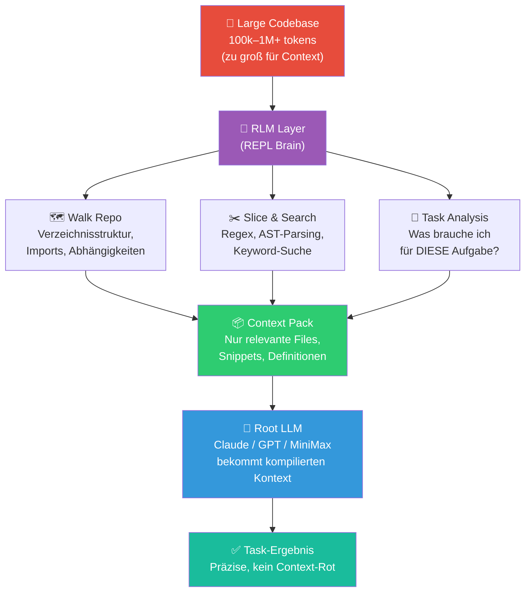

# 🧱 Compiled Context (RLM Pattern)

**Kategorie:** ai-agents
**Datum:** 2026-03-05
**Quellen:** Mitko Vasilev (LinkedIn), ysz/recursive-llm, brainqub3/claude_code_RLM
**GitHub:** https://github.com/tricksal/brickbase/tree/main/patterns/ai-agents/compiled-context

---

## Was ist das?

Wenn ein Codebase zu groß für das Context-Fenster wird, haben die meisten Entwickler einen Reflex: *mehr Tokens kaufen*. Das ist falsch.

**Compiled Context** dreht die Logik um: Statt den Repo in Tokens zu gießen, schreibst du ein Programm, das den Repo *navigiert*, die relevanten Teile *herausschneidet* und einen **task-spezifischen Kontext-Pack** zusammenstellt — wie ein Precompiled Header in C++.

> "Tokens aren't storage anymore. They're CPU. Stop buying bigger prompts. Start compiling context."
> — Mitko Vasilev, CTO

Das Ergebnis: Das Modell wirkt plötzlich, als wäre es seit 2 Jahren auf dem Projekt. Ohne 1M-Token-Bonfire.

---

## Stack (aus der Praxis)

```
Claude Code
    ↓
CCR (Context Compilation Runtime)
    ↓
RLM Gateway (REPL brain)
    ↓
vLLM / MiniMax-M2.5
```

Die entscheidende Schicht ist das **RLM Gateway** — ein REPL-Workspace, der den Repo als Variable hält (nicht als Tokens) und Programm-Code schreibt, um ihn zu traversieren.

---

## Diagramm: Context Compilation Flow



---

## Das Kernprinzip: Context Rot vs. Compiled Context

| Ansatz | Methode | Problem |
|--------|---------|---------|
| **Naiver Ansatz** | Gesamten Repo in Prompt | Context Rot: Modell "vergisst" frühe Teile, halluziniert |
| **Bigger Context** | 1M+ Token-Fenster kaufen | Teuer, langsam, Context Rot bleibt bei > 100k |
| **RAG** | Chunks embedden + retrieven | Semantisch unscharf, kein Struktur-Verständnis |
| **Compiled Context (RLM)** | Programm navigiert + kompiliert | Präzise, task-spezifisch, günstig |

**Accuracy-Verbesserung:** +20-90% vs. naivem Full-Context (BrowseComp+ Benchmark)  
**Kosten:** ~$1 statt $1.50+ bei gleichem Task

---

## Wie RLM funktioniert

### 1. REPL als Workspace

Der Codebase wird nicht in Tokens geladen — er wird als **Variable in einem Python-REPL-Environment** gehalten:

```python
# Nicht das:
prompt = f"Hier ist der gesamte Code: {entire_codebase}"  # ❌ Context-Bombe

# Sondern das:
workspace = REPLWorkspace("/path/to/repo")  # ✅ Repo als Objekt, kein Token-Overhead
```

### 2. Programm-Code zum Navigieren

Das RLM schreibt Python-Code, um den Repo zu verstehen:

```python
# RLM generiert und führt aus:
import ast, os, re

def find_relevant_files(query: str, repo_path: str) -> list[str]:
    """Finde Dateien die zum Task relevant sind."""
    relevant = []
    for root, dirs, files in os.walk(repo_path):
        # Skip: tests, docs, node_modules
        dirs[:] = [d for d in dirs if d not in ['node_modules', '.git', '__pycache__']]
        for f in files:
            if f.endswith('.py'):
                path = os.path.join(root, f)
                content = open(path).read()
                if re.search(query, content, re.IGNORECASE):
                    relevant.append(path)
    return relevant

# Für konkrete Task: "Implement rate limiting middleware"
files = find_relevant_files(r'rate.limit|middleware|auth', '/repo')
```

### 3. Context Pack zusammenstellen

```python
def build_context_pack(task: str, repo_path: str) -> str:
    """Kompiliert den minimalen Kontext für einen Task."""
    
    # 1. Relevante Dateien finden
    files = find_relevant_files(task, repo_path)
    
    # 2. Nur benötigte Teile extrahieren (Klassen, Funktionen, nicht ganzer File)
    snippets = []
    for f in files[:10]:  # Max 10 Dateien
        tree = ast.parse(open(f).read())
        for node in ast.walk(tree):
            if isinstance(node, (ast.FunctionDef, ast.ClassDef)):
                if is_relevant(node.name, task):
                    snippets.append(extract_snippet(f, node))
    
    # 3. Abhängigkeiten auflösen
    imports = resolve_imports(files, repo_path)
    
    # 4. Context Pack = nur das Nötige
    return f"""
## Relevante Files ({len(files)} von {count_all_files(repo_path)} total)
{chr(10).join(files)}

## Kern-Snippets
{chr(10).join(snippets)}

## Benötigte Interfaces
{chr(10).join(imports)}
"""

# Das Modell bekommt nur den Pack:
result = llm.complete(f"Task: {task}\n\nContext:\n{build_context_pack(task, repo)}")
```

---

## Rekursive Sub-Calls (das "R" in RLM)

Bei besonders großen Repos oder komplexen Tasks: Das Root-LLM delegiert Teilfragen rekursiv an Sub-LLM-Calls:

```python
class RLM:
    def __init__(self, model="claude-sonnet", api_base=None):
        self.model = model
        self.client = LiteLLM(model=model, api_base=api_base)
    
    def completion(self, query: str, context: str) -> str:
        """Haupt-Entry-Point: Verarbeitet unbegrenzt großen Kontext."""
        
        # Ist der Kontext zu groß?
        if count_tokens(context) > 50_000:
            # Teile auf und löse rekursiv
            chunks = self._smart_chunk(context, query)
            sub_results = [
                self.completion(query, chunk)   # Rekursion!
                for chunk in chunks
            ]
            # Aggregiere die Sub-Ergebnisse
            return self._aggregate(query, sub_results)
        else:
            # Kontext passt rein → direkt lösen
            return self.client.complete(f"{query}\n\nContext:\n{context}")
    
    def _smart_chunk(self, context: str, query: str) -> list[str]:
        """Intelligentes Chunking: nicht blind nach Zeichen, sondern nach Semantik."""
        # z.B. nach Dateigrenzen, Klassen, Funktionen chunken
        ...
    
    def _aggregate(self, query: str, results: list[str]) -> str:
        """Fasst Sub-Ergebnisse zusammen."""
        ...

# Verwendung
rlm = RLM(model="claude-sonnet-4-6")
# context kann Megabytes sein — kein Problem
answer = rlm.completion("Wo sind alle Rate-Limiting-Implementierungen?", huge_codebase_dump)
```

---

## Real-World Stack Setup

### Option A: Lokales Setup (vLLM + LiteLLM)

```bash
# vLLM als lokaler OpenAI-kompatibler Server
vllm serve mistralai/MiniMax-M2.5 --port 8000

# LiteLLM als Proxy
litellm --model openai/local --api_base http://localhost:8000/v1

# RLM drauf
pip install recursive-llm
rlm = RLM(model="openai/local", api_base="http://localhost:4000/v1")
```

### Option B: Claude Code + MCP (Cloud)

```python
# In Claude Code: MCP-Server für RLM-Kontext-Kompilierung
# brainqub3/claude_code_RLM als Scaffold
# Claude Code schreibt Python → navigiert Repo → liefert Pack
```

### Option C: Minimal (nur Python, kein Framework)

```python
# alexzhang13/rlm-minimal — Gist für schnellen Einstieg
from rlm import RLM
rlm = RLM(model="gpt-4o-mini")  # Jedes LiteLLM-kompatible Modell
result = rlm.completion(query, context=open("big_file.txt").read())
```

---

## Wann dieses Pattern?

✅ **Einsetzen wenn:**
- Codebase > 50k Tokens (typisch ab mittleren Projekten)
- Wiederkehrende Tasks auf demselben Repo
- Präzision wichtiger als Geschwindigkeit des ersten Runs
- Kosten ein Faktor sind (RLM ist deutlich günstiger als Full-Context)

❌ **Nicht nötig wenn:**
- Kleines, überschaubares Projekt (< 10k Tokens)
- Einmalige Fragen auf fremdem Code (RAG reicht)
- Task braucht wirklich den gesamten Kontext (selten!)

---

## Abgrenzung zu ähnlichen Patterns

| Pattern | Ansatz | Stärke |
|---------|--------|--------|
| **Compiled Context (RLM)** | Programm navigiert + kompiliert | Große Repos, maximale Präzision |
| **knowledge-graph-from-codebase** | Graph der Repo-Struktur | Langzeit-Wissensbasis, Exploration |
| **agent-memory-patterns** | Persistente Erinnerung | Session-übergreifende Kontinuität |
| **RAG** | Embedding + Similarity Search | Große Dokument-Collections |

**Kombination:** RLM + Knowledge-Graph = Mächtig: Graph für Struktur-Awareness, RLM für Task-spezifischen Pack.

---

## Gotchas & Learnings

### 🎯 "Compiling" braucht Domain-Wissen
Der Kontext-Pack ist nur gut, wenn der "Compiler" (RLM-Layer) versteht, was für den Task relevant ist. Eine task-spezifische Strategie ist besser als generisches Chunking.

### 🔄 Iteratives Kompilieren
Erster Context-Pack oft nicht perfekt. Das Modell kann Feedback geben: "Ich brauche noch die `auth.py`" → neuer Pack. Denk wie ein Compiler mit mehreren Passes.

### 📐 Strukturgrenzen respektieren
Nicht nach Zeichen chunken — nach Datei-, Klassen-, Funktionsgrenzen. Halb-Klassen sind nutzlos.

### 🚫 Kein Silver Bullet für alles
Für rein inhaltliche Aufgaben (Schreiben, Zusammenfassen) ist RAG oft besser. RLM glänzt bei Code-Tasks mit klarer Struktur.

---

## Referenzen

| Quelle | Key Contribution |
|--------|------------------|
| [ysz/recursive-llm](https://github.com/ysz/recursive-llm) | Core RLM Implementation, LiteLLM, Python |
| [brainqub3/claude_code_RLM](https://github.com/brainqub3/claude_code_RLM) | Claude Code REPL als RLM Scaffold |
| [alexzhang13/rlm-minimal](https://github.com/alexzhang13/rlm-minimal) | Minimale RLM-Implementierung |
| [Mitko Vasilev LinkedIn](https://www.linkedin.com/in/mitkovasilev) | Praxis-Stack: CCR → RLM → vLLM → MiniMax |
| [Brickbase Pattern](https://github.com/tricksal/brickbase/tree/main/patterns/ai-agents/compiled-context) | Code + README |
