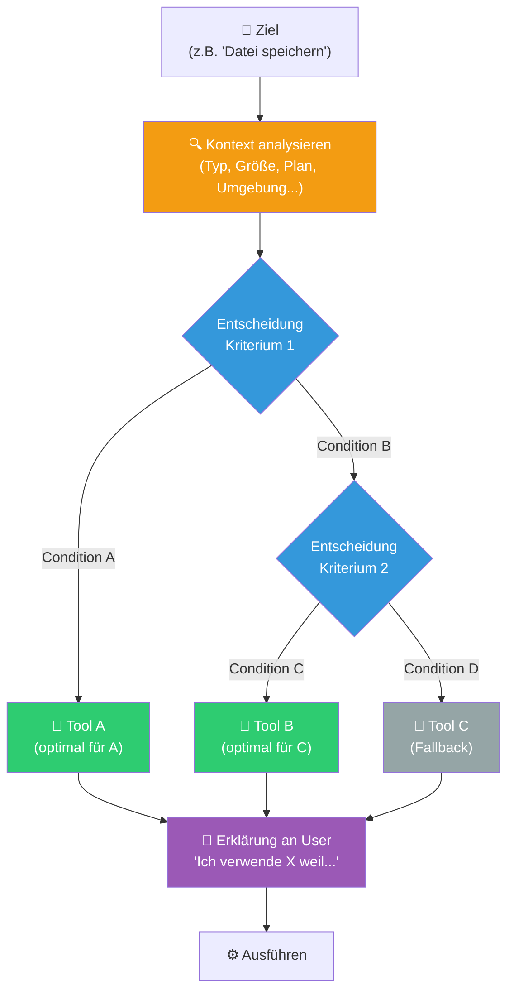

# 🧱 Context-Aware Tool Selection

**Kategorie:** ai-agents
**Datum:** 2026-03-07
**Quellen:** Anthropic "The Complete Guide to Building Skills for Claude" (2026)
**GitHub:** https://github.com/tricksal/brickbase/tree/main/patterns/ai-agents/context-aware-tool-selection

---

## Was ist das?

**Context-Aware Tool Selection** beschreibt das Pattern, bei dem ein Agent das gleiche Ziel durch unterschiedliche Tools erreicht — abhängig vom Kontext (Dateigröße, Typ, User-Plan, Umgebung, Priorität, etc.).

Der entscheidende Unterschied zu simplem Tool-Routing: Der Agent **erklärt seine Wahl** und hat **explizite Fallbacks**.

**Kernprinzip:** *"Gleicher Output — bestes Tool für diesen spezifischen Kontext"*

---

## Diagramm



---

## Implementierung

### Entscheidungsbaum in SKILL.md

```markdown
## Tool-Auswahl: Dokument parsen

### Entscheidungsregeln (in dieser Reihenfolge prüfen)

**1. Ist es ein Bild oder Scan?**
→ JA: Azure Content Understanding (prebuilt-document)
→ NEIN: weiter

**2. Ist es eine URL zu einem öffentlichen Dokument?**
→ JA: web_fetch (kostenlos, kein Upload nötig)
→ NEIN: weiter

**3. Ist die Datei > 50MB?**
→ JA: Chunk-basiertes Parsen (parse_chunks.py)
→ NEIN: Azure Content Understanding (prebuilt-layout)

**Fallback:** Wenn alle Tools fehlschlagen → Manuell mit read tool versuchen

### Nach der Auswahl: Erklären!
"Ich verwende [Tool] weil [Reason]. Alternative wäre [Alt], aber [Warum nicht]."
```

### Als Python Decision Function

```python
# scripts/select_tool.py
import sys
from pathlib import Path

def select_tool(filepath: str, context: dict) -> dict:
    """
    Wählt das optimale Tool basierend auf Kontext.
    Returns: {"tool": str, "reason": str, "fallback": str}
    """
    p = Path(filepath) if filepath else None
    
    # Priorität 1: Bilder und Scans → OCR nötig
    if p and p.suffix.lower() in [".jpg", ".jpeg", ".png", ".tiff", ".bmp"]:
        return {
            "tool": "azure_acu",
            "reason": "Bild/Scan erfordert OCR — Azure Content Understanding",
            "fallback": "tesseract_ocr"
        }
    
    # Priorität 2: Große Dateien → chunked
    if p and p.stat().st_size > 50 * 1024 * 1024:  # 50MB
        return {
            "tool": "chunked_parse",
            "reason": f"Datei {p.stat().st_size // 1024 // 1024}MB — zu groß für direkten Upload",
            "fallback": "split_and_merge"
        }
    
    # Priorität 3: User-Plan
    plan = context.get("user_plan", "funke")
    if plan == "funke" and context.get("api_credits_low"):
        return {
            "tool": "local_parser",
            "reason": "Funke-Plan mit niedrigen Credits — lokaler Parser",
            "fallback": "azure_acu"
        }
    
    # Standard: Azure ACU
    return {
        "tool": "azure_acu",
        "reason": "Standard PDF/Dokument — Azure Content Understanding optimal",
        "fallback": "local_parser"
    }

if __name__ == "__main__":
    import json
    result = select_tool(sys.argv[1], json.loads(sys.argv[2]))
    print(json.dumps(result))
```

---

## Kognitive Kriterien für Entscheidungsbäume

### Häufige Entscheidungsdimensionen

| Dimension | Beispiel-Criteria | Tool-Impact |
|-----------|------------------|-------------|
| **Dateityp** | .pdf vs .jpg vs .docx | OCR vs Layout vs Text |
| **Dateigröße** | < 1MB / 1–50MB / > 50MB | Direct / Chunked / Streaming |
| **User-Plan** | free / paid / enterprise | Basic / Full / Priority |
| **Latenz-Anforderung** | < 1s / < 10s / async ok | Cache / Fast API / Background |
| **Datenschutz** | intern / extern / sensibel | Local / EU-Cloud / On-Prem |
| **Kosten** | low / medium / high budget | Cheap / Standard / Premium |
| **Verfügbarkeit** | Primary down? | Primary / Fallback / Emergency |

---

## Transparenz-Regel

**Immer erklären, welches Tool gewählt wurde und warum:**

```
✅ Gut:
"Ich verwende Azure Content Understanding (prebuilt-layout) für diese PDF.
 web_fetch wäre günstiger, aber das Dokument liegt lokal und hat komplexe Tabellen."

❌ Schlecht:
"Ich parse jetzt das Dokument." [Tool wird unsichtbar gewählt]
```

Die Erklärung:
1. Baut Vertrauen auf
2. Ermöglicht User-Korrektur ("Nein, nutze lieber X")
3. Ist Debugging-Information bei Fehlern

---

## Anti-Pattern: Hartkodiertes Tool

```python
# ❌ Immer das gleiche Tool — egal was
def parse_document(file):
    return azure_acu.parse(file)  # Was wenn Bild? Was wenn > 50MB?
```

```python
# ✅ Kontext-bewusste Auswahl
def parse_document(file, context):
    tool_config = select_tool(file, context)
    tool = load_tool(tool_config["tool"])
    result = tool.parse(file)
    explain(tool_config["reason"])
    return result
```

---

## Verwandte Patterns

- [[agent-tool-loop]] — Grundstruktur in der die Tool-Selection stattfindet
- [[progressive-disclosure]] — Entscheidungsbaum in Ebene 2 des Skills
- [[iterative-refinement]] — Fallback als Refinement-Schritt (Tool A fehlgeschlagen → Tool B)
