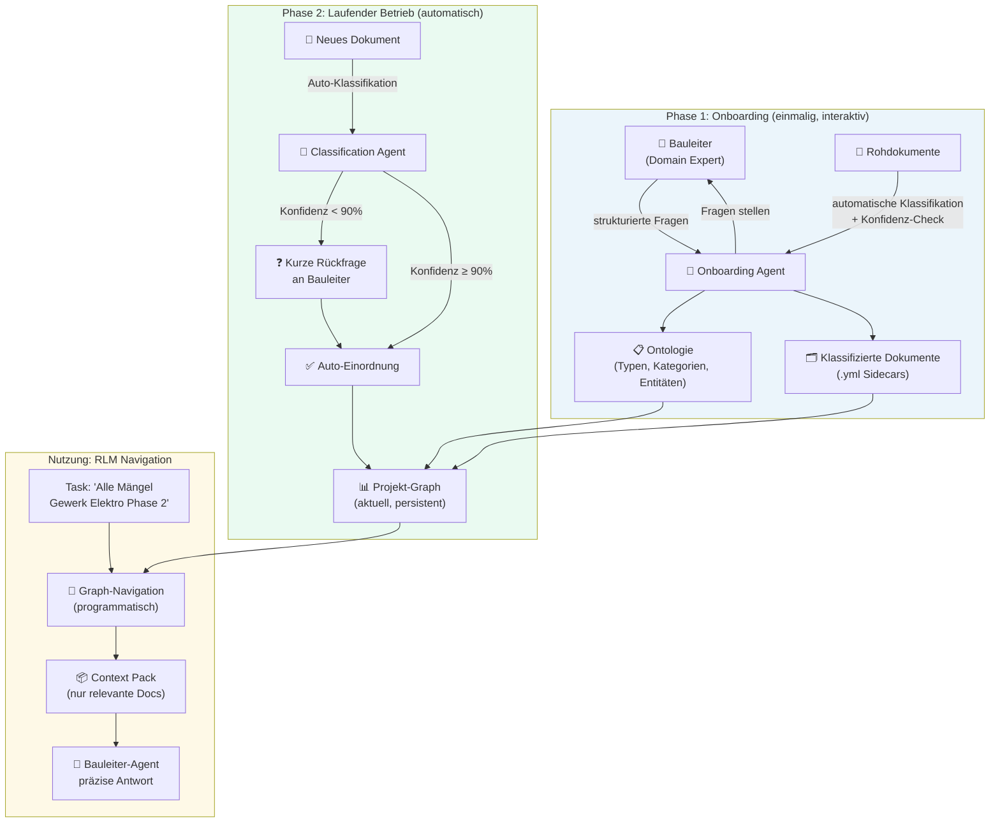

# 🧱 Document Knowledge Graph (Interactive Onboarding)

**Kategorie:** ai-agents
**Datum:** 2026-03-05
**Quellen:** OBG Bauleiter-Agent, RLM Pattern, Brickbase compiled-context
**GitHub:** https://github.com/tricksal/brickbase/tree/main/patterns/ai-agents/document-knowledge-graph

---

## Was ist das?

Code hat von Natur aus einen expliziten Abhängigkeitsgraphen — Imports, Funktionsaufrufe, Typdefinitionen. Dokumente nicht. Ein Baudokument "weiß" nicht, dass es zu Gewerk Elektro gehört.

**Document Knowledge Graph** löst genau dieses Problem: Ein zweiphasiger Prozess — einmalig interaktiv mit einem Menschen, dann automatisch — der aus einem Haufen unstrukturierter Dokumente eine *maschinenlesbare, navigierbare Wissensstruktur* macht.

Das Ergebnis: Ein Agent muss nicht mehr bei jeder Session blind suchen. Er navigiert einen Graph, kompiliert den task-spezifischen Kontext (→ RLM Pattern), und ist sofort "on project" — als wäre er seit Monaten dabei.

> Kombination mit: [compiled-context](../compiled-context/README.md) — der Graph ist die Vorstufe, RLM ist die Nutzung.

---

## Das Problem

Ein Bauleiter-Agent auf einem dokumentenintensiven Projekt (LVs, Mängelberichte, Besprechungsprotokolle, Pläne, E-Mails) tut aktuell folgendes:

```
Jede Session:
  1. Alle Dokumente laden (oder: Vektor-Suche)
  2. Relevante Teile per Keyword/Embedding finden
  3. Ergebnis: Fuzzy, unvollständig, Session-vergänglich
```

Was fehlt: *persistent gespeicherte Verbindungen zwischen den Dokumenten.* Genau das hat Code — und Dokumente müssen sich das erst "verdienen" durch einen Onboarding-Prozess.

---

## Architektur: Zwei-Phasen-Modell



---

## Phase 1: Interaktives Onboarding

### Warum interaktiv?

Code sagt dir seine Imports. Ein Baudokument sagt dir nicht, zu welchem Gewerk es gehört. Diese Information steckt in den Köpfen der Menschen auf dem Projekt — und muss genau einmal systematisch abgefragt werden.

### Die Onboarding-Fragen (Beispiel Bauprojekt)

```python
ONBOARDING_QUESTIONS = {
    "gewerke": {
        "frage": "Welche Gewerke gibt es in diesem Projekt?",
        "typ": "list",
        "beispiel": ["Elektro", "Sanitär", "HVAC", "Rohbau", "Fassade"]
    },
    "auftragnehmer": {
        "frage": "Welcher Auftragnehmer ist für welches Gewerk verantwortlich?",
        "typ": "mapping",  # gewerk → auftragnehmer
        "beispiel": {"Elektro": "Firma Müller GmbH", "Sanitär": "SHK Bayer"}
    },
    "phasen": {
        "frage": "In welche Projektphasen ist das Projekt eingeteilt?",
        "typ": "ordered_list",
        "beispiel": ["Planung", "Ausführung", "Abnahme", "Gewährleistung"]
    },
    "dokumenttypen": {
        "frage": "Welche Dokumenttypen gibt es?",
        "typ": "list",
        "beispiel": ["LV", "Mängelmeldung", "Besprechungsprotokoll", "Plan", "E-Mail"]
    },
    "gebaeudeteile": {
        "frage": "Gibt es Gebäudeteile / Abschnitte / Etagen?",
        "typ": "optional_list",
        "beispiel": ["EG", "OG1", "OG2", "Keller", "Außenanlage"]
    }
}
```

### Onboarding Agent

```python
class OnboardingAgent:
    def __init__(self, project_path: str, llm):
        self.project_path = project_path
        self.llm = llm
        self.ontology = {}

    def run(self):
        """Interaktiver Onboarding-Prozess."""
        print("🏗️  Willkommen! Ich lerne jetzt dieses Projekt kennen.\n")
        
        # 1. Strukturierte Fragen stellen
        for key, config in ONBOARDING_QUESTIONS.items():
            answer = input(f"❓ {config['frage']}\n→ ")
            self.ontology[key] = self.parse_answer(answer, config['typ'])
        
        # 2. Ontologie speichern
        self.save_ontology()
        
        # 3. Dokumente automatisch klassifizieren
        self.classify_all_documents()
        
        # 4. Unklare Fälle per Rückfrage klären
        self.review_low_confidence()
    
    def classify_document(self, doc_path: str) -> dict:
        """Klassifiziert ein Dokument anhand der Ontologie."""
        content = open(doc_path).read()[:2000]  # Erste 2k Zeichen reichen meist
        
        prompt = f"""Du bist ein Baudokument-Klassifizierer.
        
Ontologie des Projekts:
{json.dumps(self.ontology, ensure_ascii=False, indent=2)}

Klassifiziere dieses Dokument:
---
{content}
---

Antworte als JSON:
{{
  "dokumenttyp": "...",
  "gewerk": "...",  // oder null
  "auftragnehmer": "...",  // oder null
  "phase": "...",  // oder null
  "gebäudeteil": "...",  // oder null
  "zusammenfassung": "...",  // 1-2 Sätze
  "konfidenz": 0.0-1.0
}}"""
        
        return json.loads(self.llm.complete(prompt))
    
    def save_sidecar(self, doc_path: str, metadata: dict):
        """Speichert YAML-Sidecar neben dem Dokument."""
        sidecar_path = doc_path.replace('.pdf', '.yml').replace('.docx', '.yml')
        yaml.dump(metadata, open(sidecar_path, 'w'), allow_unicode=True)
```

---

## Speicherformat: YAML Sidecars + Graph-JSON

Inspiriert von Code-Systematiken: Jedes Dokument bekommt ein maschinenlesbares "Companion File" — wie ein Compiled Header.

### Verzeichnisstruktur

```
projekt/
├── project-graph/
│   ├── ontology.json           ← Typen, Kategorien, Entitäten
│   ├── graph.json              ← Alle Knoten + Kanten
│   └── entities/
│       ├── gewerke.json
│       ├── auftragnehmer.json
│       └── phasen.json
└── dokumente/
    ├── LV-Elektro-001.pdf      ← Original
    ├── LV-Elektro-001.yml      ← Sidecar ← DAS IST DER SCHLÜSSEL
    ├── Mangel-Elektro-042.pdf
    └── Mangel-Elektro-042.yml
```

### YAML Sidecar Format

```yaml
# LV-Elektro-001.yml
id: LV-Elektro-001
dokumenttyp: Leistungsverzeichnis
gewerk: elektro
auftragnehmer: Firma Müller GmbH
phase: ausführung
gebäudeteil: null
datum: 2024-09-15
zusammenfassung: "Leistungsverzeichnis für alle Elektroinstallationen, EG und OG1"
related:
  - Mangel-Elektro-003       # selbes Gewerk
  - Protokoll-2024-11-12     # selbe Phase
  - Nachtrag-Elektro-007     # Folgedokument
konfidenz: 0.97
erstellt: 2026-03-05T10:30:00
```

### Graph JSON

```json
{
  "nodes": [
    {"id": "LV-Elektro-001", "typ": "dokument", "subtyp": "LV"},
    {"id": "elektro", "typ": "gewerk"},
    {"id": "mueller_gmbh", "typ": "auftragnehmer"},
    {"id": "ausführung", "typ": "phase"}
  ],
  "edges": [
    {"from": "LV-Elektro-001", "to": "elektro", "relation": "betrifft_gewerk"},
    {"from": "LV-Elektro-001", "to": "mueller_gmbh", "relation": "auftragnehmer"},
    {"from": "LV-Elektro-001", "to": "ausführung", "relation": "gehört_zu_phase"},
    {"from": "LV-Elektro-001", "to": "Mangel-Elektro-003", "relation": "related"}
  ]
}
```

---

## Nutzung: RLM-Navigation auf dem Graph

Sobald der Graph existiert, navigiert der Agent *programmatisch* — kein blindes Suchen mehr:

```python
class ProjectGraphNavigator:
    def __init__(self, graph_path: str):
        self.graph = json.load(open(f"{graph_path}/graph.json"))
        self.sidecars = self.load_sidecars(graph_path)
    
    def compile_context(self, task: str) -> str:
        """Baut einen task-spezifischen Context Pack — wie RLM für Code."""
        
        # 1. Task analysieren (mit kleinem LLM oder Regex)
        filters = self.extract_filters(task)
        # z.B. {"gewerk": "elektro", "phase": "ausführung", "typ": "Mängelmeldung"}
        
        # 2. Graph navigieren (kein LLM-Call nötig!)
        relevant_docs = self.filter_nodes(
            gewerk=filters.get("gewerk"),
            phase=filters.get("phase"),
            dokumenttyp=filters.get("typ")
        )
        
        # 3. Related Docs über Graph-Edges einbeziehen
        extended = self.expand_via_edges(relevant_docs, depth=1)
        
        # 4. Context Pack kompilieren
        pack = []
        for doc_id in extended[:15]:  # Top 15, nicht alles
            sidecar = self.sidecars[doc_id]
            pack.append(f"""
## {doc_id}
Typ: {sidecar['dokumenttyp']} | Gewerk: {sidecar['gewerk']} | Phase: {sidecar['phase']}
{sidecar['zusammenfassung']}
""")
        
        return "\n".join(pack)

# Verwendung im Bauleiter-Agent
navigator = ProjectGraphNavigator("./project-graph")
context = navigator.compile_context("Alle offenen Mängel im Gewerk Elektro, Phase Abnahme")
answer = llm.complete(f"Task: ...\n\nKontext:\n{context}")
```

---

## Phase 2: Laufende Klassifikation neuer Dokumente

```python
class DocumentClassifier:
    CONFIDENCE_THRESHOLD = 0.90
    
    def ingest(self, new_doc_path: str, notify_user):
        metadata = self.classify_document(new_doc_path)
        
        if metadata["konfidenz"] >= self.CONFIDENCE_THRESHOLD:
            # Auto-einordnen, kein menschlicher Input nötig
            self.save_sidecar(new_doc_path, metadata)
            self.update_graph(new_doc_path, metadata)
        else:
            # Kurze Rückfrage
            clarification = notify_user(
                f"Neues Dokument: {new_doc_path}\n"
                f"Mein Vorschlag: {metadata}\n"
                f"Stimmt das so? (Konfidenz: {metadata['konfidenz']:.0%})"
            )
            corrected = self.merge(metadata, clarification)
            self.save_sidecar(new_doc_path, corrected)
            self.update_graph(new_doc_path, corrected)
```

---

## Visualisierung (Optional aber wertvoll)

Der Graph lässt sich direkt visualisieren — als Übersicht für den Bauleiter:

```python
import networkx as nx
from pyvis.network import Network

def visualize_project_graph(graph_json: dict, output: str = "project-graph.html"):
    G = nx.DiGraph()
    
    COLOR_MAP = {
        "dokument": "#3498DB",
        "gewerk": "#2ECC71", 
        "auftragnehmer": "#E74C3C",
        "phase": "#F39C12"
    }
    
    for node in graph_json["nodes"]:
        G.add_node(node["id"], color=COLOR_MAP.get(node["typ"], "#95A5A6"))
    
    for edge in graph_json["edges"]:
        G.add_edge(edge["from"], edge["to"], title=edge["relation"])
    
    net = Network(height="800px", width="100%")
    net.from_nx(G)
    net.save_graph(output)
```

---

## Wann dieses Pattern?

✅ **Einsetzen wenn:**
- Viele Dokumente (> 50), die zusammengehören aber unstrukturiert sind
- Wiederkehrende Fragen über dasselbe Dokumentenset
- Ein Domain Expert verfügbar ist (einmaliger Onboarding-Aufwand: 30-60 min)
- Präzision wichtiger als Geschwindigkeit beim ersten Setup

❌ **Nicht nötig wenn:**
- Kleine Dokumentenmengen (< 20 Docs) — einfache RAG reicht
- Einmalige Fragen auf fremden Dokumenten
- Keine Struktur im Projekt (kein Bauleiter / kein Domain Expert)

---

## Abgrenzung

| Pattern | Stärke | Grenze |
|---------|--------|--------|
| **Document KG (dieses Pattern)** | Persistent, navigierbar, präzise | Einmaliger Onboarding-Aufwand |
| **RAG (Vector Search)** | Kein Setup, sofort nutzbar | Fuzzy, session-vergänglich, teuer |
| **compiled-context (RLM)** | Inferenz-Zeit-Kompilierung | Braucht diesen Graph als Vorstufe |
| **knowledge-graph-from-codebase** | Automatisch aus Code | Nur für Code, kein menschlicher Input |

**Empfehlung:** Document KG + RLM kombinieren: Graph = das persistente Gerüst. RLM = die Nutzung bei jedem Task.

---

## Referenzen

| Quelle | Key Contribution |
|--------|------------------|
| [compiled-context (Brickbase)](../compiled-context/README.md) | RLM Pattern — Nutzungsschicht |
| [knowledge-graph-from-codebase (Brickbase)](../knowledge-graph-from-codebase/README.md) | Gleiche Idee für Code |
| OBG Bauleiter-Agent | Real-World Use Case (Baudokumentation) |
| [Brickbase Pattern](https://github.com/tricksal/brickbase/tree/main/patterns/ai-agents/document-knowledge-graph) | Code + README |
