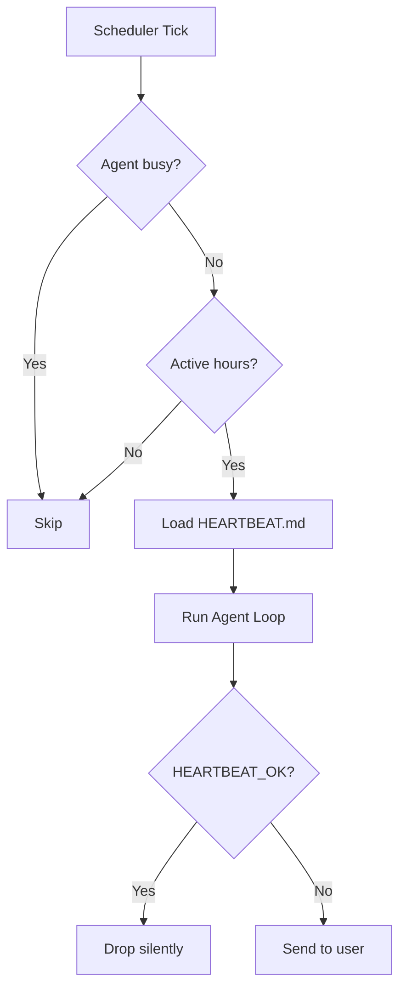

# heartbeat-lifecycle

## What
A scheduler periodically wakes an AI agent to check for actionable events; the agent either acknowledges silently (`HEARTBEAT_OK`) or delivers an alert to the user.

## When to use
- Personal AI assistants that should proactively surface important events (emails, calendar, reminders)
- Monitoring agents that run periodic health checks
- Background maintenance tasks (memory consolidation, file organisation)
- Any "always-on but not always-running" agent pattern
- Replacing a collection of small cron jobs with a single intelligent checker

## Diagram



## Core concept

```
scheduler tick (every 30min)
    ↓
active hours check → skip if outside window
    ↓
busy lock → skip if agent already running
    ↓
build prompt + inject HEARTBEAT.md checklist
    ↓
agent run (full LLM turn)
    ↓
reply starts/ends with HEARTBEAT_OK?
    yes → drop silently (no user notification)
    no  → deliver to user channel
```

The `HEARTBEAT_OK` token is the key: it lets the model semantically decide whether
the output is worth surfacing. No hardcoded rules — the model judges relevance.

**HEARTBEAT.md** is an optional checklist file in the workspace:
```md
# Heartbeat checklist
- Check for urgent emails
- Any calendar events in next 2h?
- Any blocked tasks?
```

## Dependencies
- stdlib only (`threading`, `concurrent.futures`, `datetime`, `pathlib`)

## Usage
```python
from core import HeartbeatScheduler, HeartbeatConfig, ActiveHours
from datetime import time

def my_agent(prompt: str) -> str:
    # replace with your LLM call
    return "HEARTBEAT_OK"

def my_delivery(message: str) -> None:
    send_whatsapp(message)  # or email, Slack, etc.

scheduler = HeartbeatScheduler(
    agent_fn=my_agent,
    delivery_fn=my_delivery,
    config=HeartbeatConfig(
        interval_seconds=1800,   # 30 minutes
        active_hours=ActiveHours(start=time(8, 0), end=time(23, 0)),
    ),
)
scheduler.start()
```

## Key implementation notes
- `HEARTBEAT_OK` is only treated as ACK at the **start or end** of the reply, not in the middle
- After stripping the ACK token, remaining content ≤ `ack_max_chars` (default 300) is also dropped
- A busy lock prevents overlapping runs — beats are skipped, never queued
- Heartbeat runs should NOT update session `updatedAt` (so idle expiry runs normally)
- Keep the checklist file small — it's injected into every prompt

## Cron vs Heartbeat
| | Heartbeat | Cron |
|---|---|---|
| Timing | Approximate (drifts OK) | Exact |
| Context | Full session history | Isolated |
| Batching | Multiple checks in one turn | One task per job |
| Use case | Inbox + calendar + reminders | "Every Monday 9am sharp" |

## Source
- OpenClaw docs: `docs/gateway/heartbeat.md`
- Extracted: 2026-03-04
