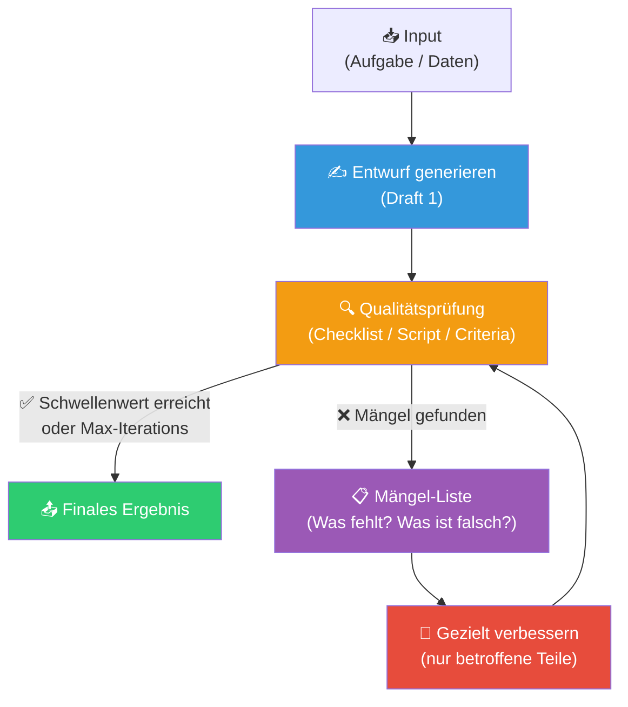

# 🧱 Iterative Refinement

**Kategorie:** ai-agents
**Datum:** 2026-03-07
**Quellen:** Anthropic "The Complete Guide to Building Skills for Claude" (2026)
**GitHub:** https://github.com/tricksal/brickbase/tree/main/patterns/ai-agents/iterative-refinement

---

## Was ist das?

**Iterative Refinement** ist ein Pattern für Aufgaben, bei denen der erste Output selten perfekt ist — und Qualität durch mehrere Runden Überprüfung + Verbesserung entsteht.

Der Agent produziert einen Entwurf, prüft ihn gegen explizite Qualitätskriterien, verbessert ihn, und wiederholt das bis ein definierter Schwellenwert erreicht ist (oder ein Max-Iterations-Limit greift).

**Kernprinzip:** *"Generate → Validate → Refine → Repeat until good enough"*

---

## Diagramm



---

## Implementierung

### Minimalstruktur in SKILL.md

```markdown
## Workflow: [Aufgabe] mit Iterativer Verbesserung

### Phase 1: Erster Entwurf
1. [Daten sammeln / Input verarbeiten]
2. Entwurf generieren
3. In temporärer Datei speichern: /tmp/draft_v1.md

### Phase 2: Qualitätsprüfung
Prüfe gegen diese Kriterien:
- [ ] Vollständigkeit: Alle Pflichtfelder vorhanden?
- [ ] Format: Entspricht Vorgabe?
- [ ] Konsistenz: Keine Widersprüche?
- [ ] Qualität: [Domain-spezifisches Kriterium]

### Phase 3: Refinement-Loop
WENN Mängel gefunden:
1. Liste alle Mängel auf
2. Behebe Mängel gezielt (nicht alles neu schreiben!)
3. Zurück zu Phase 2

WENN alle Kriterien erfüllt ODER 3 Iterationen erreicht:
→ Weiter zu Phase 4

### Phase 4: Finalisierung
1. Finales Format anwenden
2. Zusammenfassung der Änderungen
3. Ergebnis ausgeben
```

### Mit Validierungs-Script (Python)

```python
# scripts/validate_output.py
import sys, json

def check_quality(content: str) -> dict:
    issues = []
    
    if len(content) < 500:
        issues.append("Zu kurz — weniger als 500 Zeichen")
    
    if "## Fazit" not in content:
        issues.append("Fehlende Sektion: ## Fazit")
    
    if content.count("TODO") > 0:
        issues.append(f"Noch {content.count('TODO')} offene TODOs")
    
    return {
        "passed": len(issues) == 0,
        "issues": issues,
        "score": max(0, 100 - len(issues) * 25)
    }

if __name__ == "__main__":
    content = open(sys.argv[1]).read()
    result = check_quality(content)
    print(json.dumps(result, indent=2))
    sys.exit(0 if result["passed"] else 1)
```

Claude interpretiert den Exit-Code und die Issues-Liste und verbessert gezielt.

---

## Wichtige Regeln

### ✅ Richtig: Gezielt verbessern
```
Iteration 2: Fehlende Sektion "## Fazit" ergänzen,
             TODOs in Zeilen 12+47 auflösen.
             Rest bleibt unverändert.
```

### ❌ Falsch: Alles neu schreiben
```
Iteration 2: Kompletten Text neu generieren...
```
→ Verliert Qualität aus Iteration 1, verschwendet Tokens

### Wann aufhören?
Definiere **beide** Abbruch-Bedingungen explizit:
1. `score >= 80` (Qualitätsschwellenwert erreicht)
2. `iterations >= 3` (Max-Limit gegen Endlosschleifen)

---

## Anwendungsfälle

| Use Case | Qualitätskriterien | Iterations-Limit |
|----------|-------------------|------------------|
| Report-Generierung | Vollständigkeit, Format, Datenvalidität | 3 |
| Code-Review + Fix | Tests grün, Linter-Warnungen = 0 | 5 |
| Karten aus Dokument | Alle Pflichtfelder, keine Duplikate | 2 |
| Übersetzung | Terminologie-Konsistenz, Stil-Guide | 3 |
| Bewerbungsschreiben | Schlüsselwörter vorhanden, Länge korrekt | 4 |

---

## Verwandte Patterns

- [[agent-tool-loop]] — Grundstruktur des Agentic Loop (Refinement ist ein spezieller Loop)
- [[agent-todo-list]] — Mängel-Liste als strukturierte TODO-Liste
- [[progressive-disclosure]] — Qualitätskriterien typischerweise in Ebene 2
