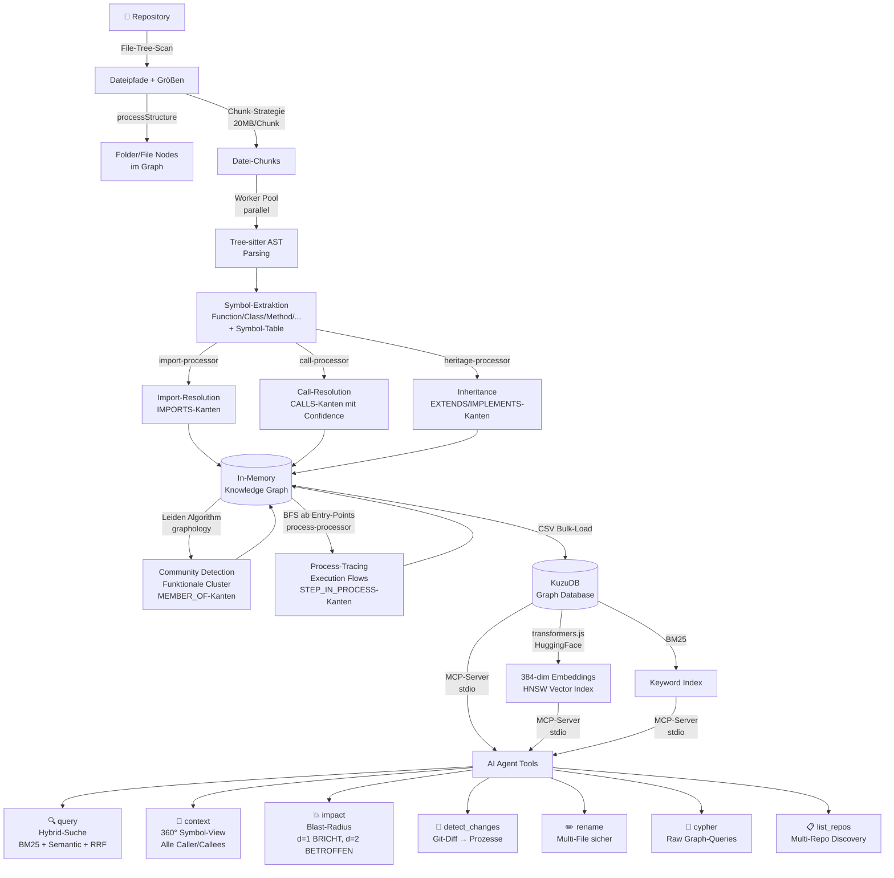

# 🧱 Knowledge Graph from Codebase

**Pattern:** `ai-agents/knowledge-graph-from-codebase`
**Kategorie:** AI Agents
**Schwierigkeit:** Advanced
**Sprachen:** TypeScript (Referenz), Python (Demo)

---

## TL;DR

Wandle jede Codebase in einen abfragbaren Knowledge Graph um — mit Symbolen als Knoten und Beziehungen (CALLS, IMPORTS, EXTENDS) als Kanten. AI-Agents können dann mit einem Tool-Call vollständige Architektur-Informationen abrufen, statt durch dozens von Datei-Suchen zu iterieren.

**Kerninnovation:** Struktur wird bei Index-Zeit vorberechnet (Communities, Execution Flows), nicht on-demand — dadurch sind Tool-Antworten sofort vollständig.

---

## Das Problem

AI-Agents wie Cursor, Claude Code oder Windsurf kennen deine Codebase-Struktur nicht wirklich:

1. Agent ändert `UserService.validate()`
2. Weiß nicht: 47 Funktionen hängen davon ab
3. **Breaking Changes landen in Production**

Traditionelle Graph-RAG-Ansätze lösen das nicht zuverlässig — sie geben dem LLM rohe Graph-Kanten und hoffen, dass es genug exploriert.

---

## Die Pipeline



---

## Phasen im Detail

### Phase 1: File-Tree-Scan
- Traversiert das Repository ohne Dateiinhalte zu lesen
- Erfasst Dateigröße für Chunk-Budgetierung
- Erstellt `Folder → CONTAINS → File` Knoten
- Überspringt `.gitignore`-Patterns

### Phase 2: AST-Parsing (Symbol-Extraktion)
- Lädt Dateien in **20MB-Chunks** (Memory-Management für große Repos)
- Parsed parallel mit **Worker Threads** (Node.js)
- **Tree-sitter** extrahiert Symbole aus 12+ Sprachen
- Symbol-Typen: `Function`, `Class`, `Interface`, `Method`, `Struct`, `Enum`, `Trait`, `Impl`, ...
- Pro Symbol: Name, Datei, Zeilen, exportiert?, Source-Code

### Phase 3: Resolution
- **Import-Resolution:** Suffix-Index aller Dateipfade für O(1)-Lookup
- **Call-Resolution:** Findet Funktionsaufrufe, mappt auf Symbole via Symbol-Table
- **Heritage-Resolution:** `extends` / `implements` / `: BaseClass`
- Confidence-Scores für unsichere Auflösungen (dynamische Calls < 1.0)

### Phase 4: Community Detection
- **Leiden-Algorithmus** (Modularitätsoptimierung) auf dem CALLS-Graphen
- Findet Cluster zusammenhängender Code-Bereiche (z.B. "Authentication", "Database")
- Unabhängig von Ordner-Struktur — basiert auf tatsächlicher Code-Nutzung
- Communities werden als `Community`-Knoten gespeichert → `MEMBER_OF`-Kanten

### Phase 5: Process-Tracing
1. Entry Points finden: Symbole ohne interne Caller + Scoring (Exports, Framework-Patterns)
2. BFS-Traversal vom Entry Point durch CALLS-Kanten (max Tiefe: 10)
3. Execution Traces deduplizieren
4. Heuristisches Labeling: "HandleLogin → CreateSession"
5. Klassifikation: `intra_community` vs. `cross_community`

### Phase 6: Speicherung (KuzuDB)
- CSV-Bulk-Load (viel schneller als einzelne INSERTs)
- **Hybrid-Schema:** Separate Node-Tables pro Typ, aber NUR EINE `CodeRelation`-Table
- Embeddings (384-dim, HNSW, cosine similarity) in separater `CodeEmbedding`-Table
- BM25-Index für Keyword-Suche

### Phase 7: MCP-Exposure
- MCP-Server via stdio
- Globale Registry `~/.gitnexus/registry.json` → Multi-Repo-Support
- Lazy KuzuDB-Verbindungen (max 5, 5min Inaktivitäts-Timeout)
- **7 Tools** mit vollständig vorberechneten Antworten

---

## Graph-Schema

### Knoten

| Typ | Properties | Beschreibung |
|-----|-----------|-------------|
| `File` | id, name, filePath, content | Quell-Datei |
| `Folder` | id, name, filePath | Ordner |
| `Function` | id, name, filePath, startLine, endLine, isExported, content | Funktion |
| `Class` | wie Function | Klasse |
| `Interface` | wie Function | Interface / Protocol |
| `Method` | wie Function | Klassenmethode |
| `Community` | id, label, heuristicLabel, cohesion, symbolCount | Funktionaler Cluster |
| `Process` | id, label, heuristicLabel, processType, stepCount, communities | Execution Flow |
| Multi-lang | `Struct`, `Enum`, `Trait`, `Impl`, `Macro`, `TypeAlias`, ... | Sprachspezifisch |

### Kanten (alle via `CodeRelation` mit `type`-Property)

| Typ | Von → Nach | Bedeutung |
|-----|-----------|----------|
| `CONTAINS` | Folder→File, File→Symbol | Hierarchie |
| `DEFINES` | File→Symbol | Toplevel-Definition |
| `IMPORTS` | File→File | Import-Abhängigkeit |
| `CALLS` | Symbol→Symbol | Funktionsaufruf |
| `EXTENDS` | Class→Class | Vererbung |
| `IMPLEMENTS` | Class→Interface | Interface-Implementierung |
| `MEMBER_OF` | Symbol→Community | Cluster-Zugehörigkeit |
| `STEP_IN_PROCESS` | Symbol→Process | Schritt in Execution Flow |

**Kanten-Properties:** `confidence DOUBLE`, `reason STRING`, `step INT32`

---

## MCP-Tools

| Tool | Eingabe | Ausgabe |
|------|---------|---------|
| `list_repos` | — | Alle indizierten Repos mit Metadata |
| `query` | `query`, `task_context`, `goal` | Execution Flows + Symbole (BM25+Semantic+RRF) |
| `context` | `name` oder `uid` | Alle Caller, Callees, Prozesse eines Symbols |
| `impact` | `target`, `direction`, `maxDepth` | Blast-Radius gruppiert nach Tiefe + Risk-Level |
| `detect_changes` | `scope` | Git-Diff → betroffene Symbole + Prozesse |
| `rename` | `symbol_name`, `new_name` | Multi-File Rename (Graph + Text-Search) |
| `cypher` | Cypher-Query-String | Tabelle als Markdown |

---

## Code

### [`core.py`](./core.py) — Vereinfachte Python-Demo

Zeigt das Konzept ohne externe Abhängigkeiten:
- `build_knowledge_graph(repo_path)` — AST-Parsing + Call-Resolution
- `impact_analysis(graph, target_name)` — Upstream/Downstream-Traversal
- `detect_processes(graph)` — Entry Points + BFS-Traces
- `search_symbols(graph, query)` — Keyword-Suche

```bash
# Direkt ausführen (analysiert sich selbst):
python patterns/ai-agents/knowledge-graph-from-codebase/core.py
```

---

## Wann einsetzen?

**✅ Einsetzen wenn:**
- Codebase > 50 Dateien, AI-Agent verliert den Überblick
- Refactoring geplant, Blast-Radius unklar
- Onboarding in fremde Codebase (Execution Flows sofort sehen)
- Pre-Commit-Sicherheit vor komplexen Änderungen
- Kleinere LLM-Modelle nutzen (Tools kompensieren fehlende Modell-Kapazität)

**❌ Nicht nötig wenn:**
- < 20 Dateien
- Einmalige Analyse
- Statische, nie-ändernde Codebase

---

## Referenz-Implementierung

**GitNexus** von abhigyanpatwari — vollständige Production-Implementierung:

```bash
# Direkt ausprobieren:
npx gitnexus analyze    # Indexiert aktuelles Repo
npx gitnexus mcp        # Startet MCP-Server für AI-Agent
```

- **Repo:** https://github.com/abhigyanpatwari/GitNexus
- **Tech Stack:** Node.js, TypeScript, Tree-sitter, KuzuDB, transformers.js, Graphology (Leiden), MCP
- **Sprachen:** TypeScript, JavaScript, Python, Java, Kotlin, C, C++, C#, Go, Rust, PHP, Swift

---

## Verwandte Patterns

- [`agent-tool-loop`](../agent-tool-loop/) — Wie AI-Agents Tools iterativ nutzen
- [`sub-agent-delegation`](../sub-agent-delegation/) — Multi-Agent-Koordination
- [`heartbeat-lifecycle`](../heartbeat-lifecycle/) — Persistente Agent-Kontexte

---

*Teil von [Brickbase](https://github.com/tricksal/brickbase) — öffentliche Wissensdatenbank für Code-Patterns*
