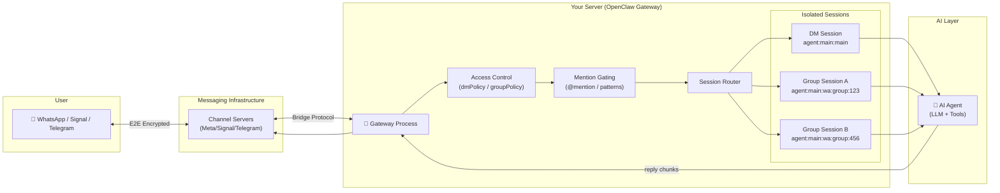
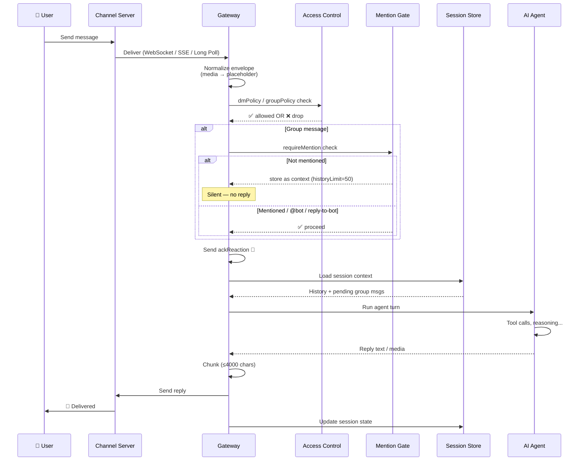

# 🧱 Messaging Channel Agent

**Kategorie:** ai-agents | **Datum:** 2026-03-04

> Make your AI agent reachable via WhatsApp, Signal, or Telegram — no app install required for users.

---

## What this pattern solves

Users don't want yet another app. This pattern puts your AI agent *inside* the messaging apps people already use every day. A bridge layer connects the messaging service to your agent, routing each conversation into an isolated session. Works for 1:1 DMs and group chats.

---

## Architecture



---

## Message Flow



---

## Channel Comparison

| Feature | WhatsApp | Signal | Telegram |
|---|---|---|---|
| **Setup difficulty** | Medium (QR scan) | High (signal-cli + Java) | Low (BotFather) |
| **API type** | Unofficial (Baileys) | Open Source (signal-cli) | Official Bot API |
| **Stability risk** | High (Meta may ban) | Medium (API breaks) | Low |
| **Real bot account** | ❌ uses your number | ❌ uses your number | ✅ separate bot |
| **Group @mentions** | ✅ Native | ⚠️ Pattern-only | ✅ Native |
| **End-to-end encryption** | ✅ | ✅ | 🟡 (secret chats only) |
| **Live typing indicator** | ✅ | ✅ | ✅ (stream preview) |
| **Multi-account** | ✅ | ✅ | ✅ |
| **Best for** | Personal / small teams | Privacy-first | Public bots / teams |

---

## Session Keys (how sessions are isolated)

```
DM  (default)   → agent:main:main                          ← all DMs share one session
DM  (per-user)  → agent:main:<channel>:dm:<sender>         ← isolated per user ✅ safer
Group           → agent:main:<channel>:group:<group_id>    ← always isolated
Telegram topic  → agent:main:telegram:group:<id>:topic:<thread>
```

> ⚠️ **Security:** If multiple users can DM your agent, set `dmScope: "per-channel-peer"` — otherwise all users share the same conversation context!

---

## Group Trigger Logic

```
Incoming group message
    │
    ▼
groupPolicy == disabled? ──yes──► DROP
    │ no
    ▼
Sender in groupAllowFrom? ──no──► DROP
    │ yes
    ▼
requireMention == false? ──yes──► REPLY
    │ no
    ▼
@mentioned? or reply-to-bot? ──yes──► REPLY
    │ no
    ▼
Store as pending context (historyLimit=50)
    └─► when bot IS triggered later, inject these as context
```

**Configure via:**
```json5
{
  channels: {
    whatsapp: {
      groupPolicy: "allowlist",
      groupAllowFrom: ["+49151..."],
      groups: {
        "*":             { requireMention: true  },  // default: @mention required
        "123@g.us":      { requireMention: false }   // this group: always reply
      }
    }
  },
  agents: {
    list: [{
      groupChat: {
        mentionPatterns: ["@mybot", "mybot", "\\+49151..."],
        historyLimit: 50
      }
    }]
  }
}
```

---

## Quick Setup

### Telegram (easiest)
```bash
# 1. Create bot via @BotFather → get token
# 2. Configure
cat >> ~/.openclaw/openclaw.json << 'EOF'
{
  "channels": {
    "telegram": {
      "botToken": "YOUR_TOKEN",
      "dmPolicy": "pairing",
      "groups": { "*": { "requireMention": true } }
    }
  }
}
EOF

# 3. Start gateway
openclaw gateway

# 4. DM your bot → approve pairing
openclaw pairing list telegram
openclaw pairing approve telegram <CODE>
```

### WhatsApp
```bash
# 1. Configure
# ~/.openclaw/openclaw.json → channels.whatsapp.dmPolicy = "pairing"

# 2. Link (QR scan in WhatsApp → Linked Devices)
openclaw channels login --channel whatsapp

# 3. Start
openclaw gateway

# 4. Approve first contact
openclaw pairing approve whatsapp <CODE>
```

### Signal
```bash
# Install signal-cli (Linux)
VERSION=$(curl -Ls -o /dev/null -w %{url_effective} https://github.com/AsamK/signal-cli/releases/latest | sed 's|.*/v||')
curl -LO "https://github.com/AsamK/signal-cli/releases/download/v${VERSION}/signal-cli-${VERSION}-Linux-native.tar.gz"
sudo tar xf signal-cli-*.tar.gz -C /opt && sudo ln -sf /opt/signal-cli /usr/local/bin/

# Option A: link existing Signal account
signal-cli link -n "MyBot"  # scan QR in Signal app

# Option B: register new number
signal-cli -a +NUMBER register --captcha 'signalcaptcha://...'
signal-cli -a +NUMBER verify <SMS_CODE>

# Configure + start
openclaw gateway
```

---

## Core Implementation (`core.py`)

The reference implementation in this directory provides:

| Class | Role |
|---|---|
| `WebhookServer` | HTTP server that receives normalized inbound messages |
| `SessionRouter` | Routes DMs and group messages to isolated `Session` objects |
| `GroupTriggerFilter` | Decides if agent should reply (@mention, keywords, always) |
| `AgentBridge` | Calls agent, handles context injection, sends reply |

```bash
python core.py
# → Server at http://localhost:8765/webhook

# Test DM
curl -X POST http://localhost:8765/webhook \
     -H "Content-Type: application/json" \
     -d '{"type":"dm","sender":"+49151123","text":"Hello!"}'

# Test group with @mention
curl -X POST http://localhost:8765/webhook \
     -H "Content-Type: application/json" \
     -d '{"type":"group","group_id":"grp1","sender":"+49151123","text":"@bot explain this"}'
```

Replace `AgentBridge._call_agent()` with your LLM API call to make it real.

---

## Gotchas

- **WhatsApp ban risk:** Baileys is unofficial. Use a separate bot number. Avoid bulk messaging.
- **Bun ≠ compatible:** WhatsApp + Telegram Gateway requires **Node.js**, not Bun.
- **Signal @mentions:** No native mention support — rely on `mentionPatterns` in config.
- **Telegram privacy mode:** If bot doesn't see all group messages → BotFather `/setprivacy` disable, then re-add bot to group.
- **Multi-user DM security:** Default `dmScope: "main"` is **unsafe** for multiple users — switch to `per-channel-peer`.
- **Group history context:** Up to 50 un-triggered messages are injected as context when bot finally replies. Can fill context window — set `historyLimit: 0` to disable.
- **JSON5 duplicate keys:** Multiple `groupPolicy` entries in config — last one wins silently.

---

## References

- [OpenClaw WhatsApp Docs](https://openclaw.dev/channels/whatsapp)
- [OpenClaw Signal Docs](https://openclaw.dev/channels/signal)
- [OpenClaw Telegram Docs](https://openclaw.dev/channels/telegram)
- [OpenClaw Session Management](https://openclaw.dev/concepts/session)
- [Baileys (WhatsApp Web)](https://github.com/WhiskeySockets/Baileys)
- [signal-cli](https://github.com/AsamK/signal-cli)
- [Telegram Bot API](https://core.telegram.org/bots/api)
