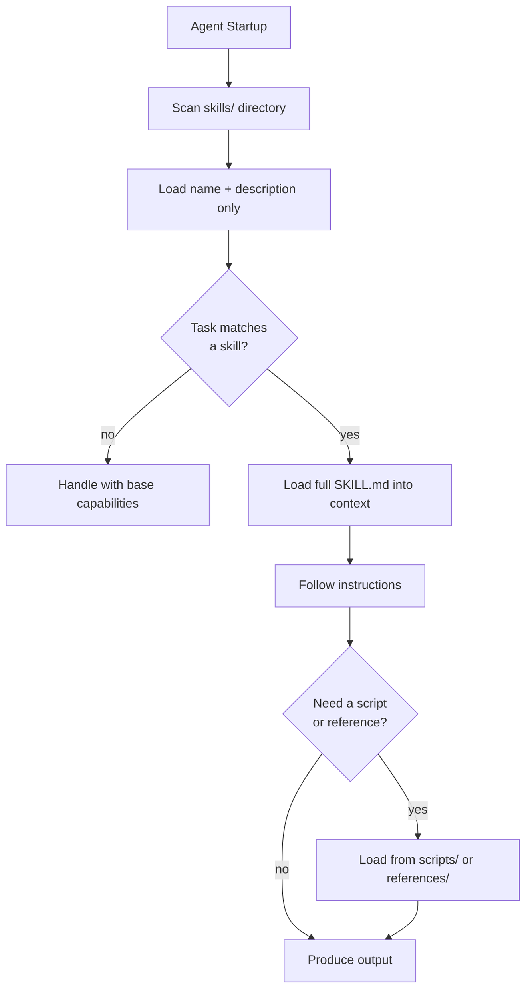

# portable-agent-skills

## What
A skill is a folder with a `SKILL.md` file. That file contains metadata and instructions. Any agent that knows the format can load it, activate it, and follow it.

The AgentSkills format (agentskills.io) is an open standard by Anthropic that turns this simple convention into a shared interface across tools: Cursor, Gemini CLI, OpenHands, Claude Code, OpenCode, and others all speak the same format.

## When to use
- You want to give an agent specialized knowledge or workflows that go beyond its defaults
- You want to reuse the same skill across different agents or tools
- You want to share skills with other teams or publish them publicly
- You are building an agent and want to support community-maintained skill libraries

## Diagram



## Structure of a skill

```
my-skill/
+-- SKILL.md          # Required
+-- scripts/          # Optional: shell scripts, Python tools
+-- references/       # Optional: docs, API specs, examples
+-- assets/           # Optional: templates, static files
```

**SKILL.md** always starts with YAML frontmatter:

```yaml
---
name: pdf-processing
description: Extract text and tables from PDF files, fill forms, merge documents.
             Use when working with PDF documents.
license: MIT
---

# PDF Processing

## When to use this skill
...

## Step-by-step instructions
...
```

## Key fields

| Field | Required | Notes |
|---|---|---|
| `name` | Yes | Lowercase, hyphens only, matches directory name |
| `description` | Yes | Max 1024 chars. This is the trigger. |
| `license` | No | License name or file reference |
| `compatibility` | No | e.g. "Requires git and docker" |
| `metadata` | No | Key-value pairs for tooling |
| `allowed-tools` | No | Pre-approved tools (experimental) |

## Progressive disclosure

Loading happens in three phases to keep context cost low:

1. **Discovery (startup):** Agent loads only `name` and `description` for all skills. Maybe 20-40 tokens per skill.
2. **Activation (on task match):** Agent reads the full `SKILL.md` body into context.
3. **On demand:** Referenced files and scripts are loaded only when actually needed.

This is why `description` matters so much: it carries the entire burden of triggering. The agent sees only the description when deciding whether to load a skill.

## Writing good descriptions

The description is an instruction to the agent, not a marketing blurb:

```yaml
# Good: imperative, task-keywords, tells the agent when to act
description: Extract text and tables from PDF files, fill PDF forms, merge documents.
             Use when working with PDFs or when the user mentions forms or extraction.

# Bad: too vague, no trigger context
description: Helps with PDFs.
```

Principles:
- Use imperative phrasing ("Use when...", "Extract...", "Deploy...")
- List specific keywords the user might actually say
- Name the format, tool, or domain explicitly

## Core concept

Most agents start with a single, flat system prompt. Skills extend this without rewriting the prompt. The agent discovers what it can do at startup, then loads the relevant instructions only when needed. This keeps the base context lean while enabling deep specialization.

The same skill file works in Cursor, in Claude Code, in Gemini CLI, in your own custom agent. That portability means a skill you write once can be used, reviewed, and improved by anyone.

## Dependencies
- `pyyaml` for parsing frontmatter: `pip install pyyaml`
- No other dependencies for `core.py`

## Usage

```python
from core import SkillRegistry, create_skill

# Create a skill
create_skill(
    "~/.skills",
    name="deploy-vps",
    description="Deploy static websites to a VPS via rsync and nginx. "
                "Use when the user wants to deploy or update a website.",
    instructions="# Deploy to VPS\n\n## Steps\n1. rsync files...",
)

# Load registry at agent startup
registry = SkillRegistry()
registry.scan("~/.skills")

# Inject into system prompt (startup context, lightweight)
system_prompt = registry.startup_context()

# Activate when needed (full instructions)
skill = registry.activate("deploy-vps")
print(skill.instructions)

# Find skills by task description
matches = registry.find_by_task("I need to push the latest changes to production")
```

## Key implementation notes
- `name` must exactly match the directory name (enforced at parse time)
- `consecutive hyphens are forbidden` in skill names (spec requirement)
- The `description` is the only thing the agent sees at startup for triggering decisions
- Scripts in `scripts/` should be self-contained with clear CLI interfaces
- Keep `SKILL.md` body under ~5000 tokens; split large content into `references/` files

## Related
- Spec: https://agentskills.io/specification.md
- Example skills: https://github.com/anthropics/skills
- Reference library: https://github.com/agentskills/agentskills

## Related Brickbase patterns
- command-skill-orchestration: how to orchestrate commands that call skills
- compiled-context: pre-building context for efficiency
- progressive-disclosure: the loading strategy used by this pattern
