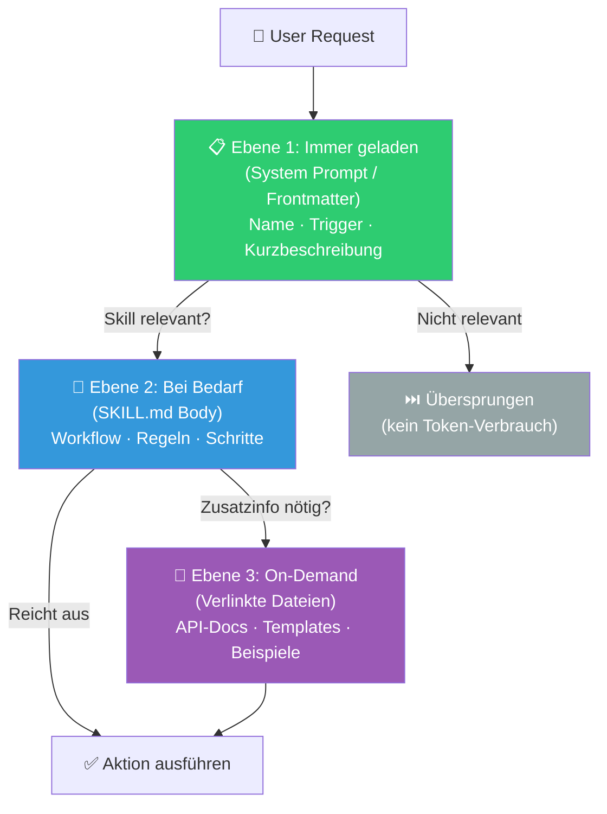

# 🧱 Progressive Disclosure

**Kategorie:** ai-agents
**Datum:** 2026-03-07
**Quellen:** Anthropic "The Complete Guide to Building Skills for Claude" (2026)
**GitHub:** https://github.com/tricksal/brickbase/tree/main/patterns/ai-agents/progressive-disclosure

---

## Was ist das?

**Progressive Disclosure** ist ein Prinzip für die Strukturierung von Agent-Kontexten: Informationen werden in drei Ebenen aufgeteilt, die unterschiedlich früh und häufig geladen werden. Nur was wirklich gebraucht wird, landet im Kontext.

Das Ziel: **minimaler Token-Verbrauch bei maximaler Spezialisierung**.

| Ebene | Was | Wann geladen | Token-Kosten |
|-------|-----|-------------|-------------|
| 1 — Frontmatter / Summary | Name, kurze Beschreibung, Trigger-Phrasen | Immer (System Prompt) | Klein (50–150 Token) |
| 2 — Hauptdokument / SKILL.md Body | Vollständige Anweisungen, Workflow-Schritte | Wenn Skill/Modul relevant | Mittel (500–2000 Token) |
| 3 — Verlinkte Dateien | Referenz-Docs, Beispiele, Templates | Nur wenn explizit gebraucht | Groß (on-demand) |

---

## Diagramm



---

## Das Prinzip in der Praxis

### Ebene 1 — Immer im Context (YAML Frontmatter)

```yaml
---
name: doc-parse
description: >
  Parse PDFs, Word-Dokumente, Bilder → Markdown via Azure Content Understanding.
  Aktiviert bei: "parse dieses PDF", "extrahiere Text", "Dokument zu Markdown".
  Nicht für: einfache Textdateien, Web-URLs ohne Dokument.
triggers:
  - "parse"
  - "extrahiere Text"
  - "PDF zu Karten"
---
```

**Regeln für Ebene 1:**
- So kurz wie möglich (< 150 Token)
- Klare Trigger-Phrasen (was sagt ein User typischerweise?)
- Negative Trigger: "Nicht für X" verhindert Over-Triggering
- Keine Implementierungsdetails

### Ebene 2 — Vollständige Anweisungen (SKILL.md Body)

Wird geladen wenn Claude entscheidet, dass der Skill relevant ist. Enthält:
- Schritt-für-Schritt-Workflow
- Entscheidungsregeln
- Fehlerbehandlung
- Code-Snippets / Befehle

### Ebene 3 — Verlinkte Dateien (on-demand)

```markdown
## Weiterführend

Für API-Details: [Sieh references/azure-acu-api.md]
Für Beispiel-Output: [Sieh references/beispiel-output.md]
```

Claude navigiert diese Dateien nur wenn es sie braucht — nie pauschal.

---

## Anti-Pattern: Alles in Ebene 2 packen

```markdown
# ❌ Schlecht: 8000-Token-SKILL.md

Hier ist alles über unsere API, alle Endpoints, alle Parameter,
alle Beispiele, alle Edge Cases, alle Fehler-Codes, alle
historischen Kontext-Infos...
```

**Problem:** Claude lädt diese Datei bei JEDER relevanten Anfrage komplett. Massive Token-Verschwendung und Kontext-Clutter.

---

## Wann dieses Pattern anwenden?

✅ **Gut für:**
- Skills / Command-Module mit vielen Details
- Agent-Systeme mit vielen spezialisierten Fähigkeiten
- RAG-Systeme wo nicht alle Dokumente immer relevant sind
- Multi-Skill-Setups (Skills konkurrieren um Kontext-Budget)

❌ **Nicht nötig bei:**
- Einfachen Single-Purpose-Agents
- Wenigen, immer gleich relevanten Infos
- Sehr kurzen Kontexten (< 1000 Token gesamt)

---

## Verwandte Patterns

- [[command-skill-orchestration]] — Orchestriert mehrere Skills mit Progressive Disclosure
- [[compiled-context]] — Komprimiert Kontext für lange Sessions
- [[context-aware-tool-selection]] — Ebene 2 enthält typischerweise den Entscheidungsbaum
