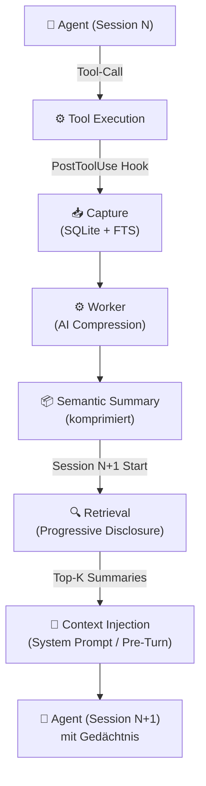

# 🧱 Session Observation Compression

**Kategorie:** ai-agents  
**Datum:** 2026-03-07  
**Quellen:** [claude-mem](https://github.com/thedotmack/claude-mem) (thedotmack), OpenClaw Memory System  
**GitHub:** https://github.com/tricksal/brickbase/tree/main/patterns/ai-agents/session-observation-compression

---

## Was ist das?

AI-Agent-Sessions produzieren eine Menge Kontext: jeder Tool-Call, jedes Ergebnis, jede Entscheidung. Aber Sessions enden — und beim Neustart ist alles weg.

**Session Observation Compression** löst das automatisch:
1. **Capture** — Jede Tool-Observation wird via Hooks (PostToolUse) in Echtzeit aufgezeichnet
2. **Compress** — Ein Worker-Prozess komprimiert Observations mit AI zu semantischen Summaries
3. **Inject** — Beim Session-Start werden die relevantesten komprimierten Summaries injiziert

Das Ergebnis: Der Agent "erinnert sich" — ohne manuelle Memory-Pflege, ohne Token-Explosion.

---

## Diagramm



---

## Drei Komponenten

### 1. Observation Capture (Hooks)
```json
// Claude Code hooks.json
{
  "hooks": {
    "PostToolUse": [{
      "matcher": "*",
      "hooks": [{"type": "command", "command": "mem-capture '$CLAUDE_TOOL_RESULT'"}]
    }]
  }
}
```
- Deterministisch — jede Observation wird captured, unabhängig vom Agenten
- Kein manuelles "remember this" nötig
- Storage: SQLite mit Full-Text-Search für schnelle Retrieval

### 2. AI Compression (Worker)
```
Raw Observations:
- "Read file backend/ai.py (3847 chars)"
- "Edited ai.py lines 45-67: replaced Anthropic call with Azure"
- "Ran docker compose up: success, 4 containers running"

→ Compressed Summary:
"Azure OpenAI (GPT-4.1) als primärer Vision-Provider implementiert.
 backend/ai.py refactored. Alle 4 Container laufen auf VPS 72.62.38.126."
```
- Worker läuft asynchron (kein Blocking des Agents)
- Kompression-Ratio: typisch 10:1 bis 50:1 (Token-Einsparung!)
- Semantic Clustering: ähnliche Observations werden zusammengefasst

### 3. Progressive Context Injection
Beim Session-Start: nicht alles injizieren, sondern gestaffelt:

```
Layer 1: Project Summary (immer, ~200 Token)
Layer 2: Recent Sessions (letzte 3, ~500 Token)  
Layer 3: Task-relevante Observations (on-demand, ~1000 Token)
```
→ Verwandt mit [[../progressive-disclosure|Progressive Disclosure]] Pattern

---

## Implementierung: Minimale Variante

Ohne Plugin, nur mit OpenClaw/Botto:
```bash
# Nach jeder Session: Observations ins Memory-File schreiben
echo "### Session $(date +%Y-%m-%d)" >> memory/sessions.md
echo "$CLAUDE_LAST_OBSERVATIONS" | claude-compress >> memory/sessions.md

# Beim Session-Start: relevante Memory-Einträge lesen
memory_search "was haben wir zuletzt bei Projekt X gemacht?"
```

Das ist genau das, was Botto's `memory/YYYY-MM-DD.md` manuell macht — 
claude-mem automatisiert es vollständig.

---

## Wann nutzen?

✅ **Gut wenn:**
- Langläufige Projekte mit vielen Sessions (Kognio, TelefonAgent)
- Viele kleine Tool-Calls die zusammen Bedeutung haben
- Kein manuelles Memory-Management gewünscht

⚠️ **Nicht ideal wenn:**
- One-off Tasks (kein Wiederkehr-Bedarf)
- Sehr sensible Daten (Observations können sensitive Info enthalten)
- Storage-Constraints (SQLite wächst mit der Zeit)

---

## Privacy & Control

Observations mit sensitiven Daten ausschließen:
```
# Claude Code CLAUDE.md
[mem:exclude] - Dieser Block wird nicht captured
API Keys: sk-...  [mem:exclude]
```

---

## Verwandte Patterns

- [[../agent-memory-patterns|Agent Memory Patterns]] — Überblick über alle Memory-Ansätze
- [[../agent-hooks|Agent Hooks]] — Hooks-Mechanismus (Grundlage dieses Patterns)
- [[../progressive-disclosure|Progressive Disclosure]] — Gestaffelte Kontext-Injektion
- [[../compiled-context|Compiled Context]] — Alternative: task-spezifische Kontext-Kompilierung

---

## Referenzen

- [claude-mem GitHub](https://github.com/thedotmack/claude-mem) — Referenz-Implementation für Claude Code
- [OpenClaw Integration](https://docs.claude-mem.ai/openclaw-integration) — OpenClaw-spezifische Installation
- [Architecture Evolution](https://docs.claude-mem.ai/architecture-evolution) — Wie das Pattern sich entwickelt hat
- [Progressive Disclosure Docs](https://docs.claude-mem.ai/progressive-disclosure) — Philosophie dahinter
