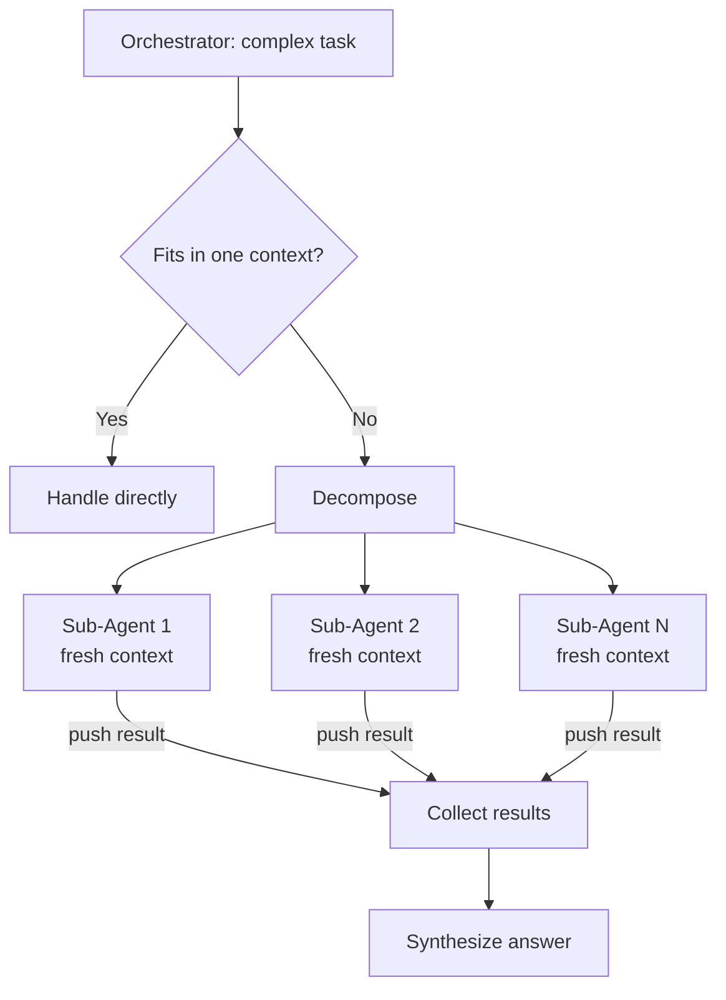

# sub-agent-delegation

## What
A main orchestrator agent spawns isolated sub-agents for focused sub-tasks, each with its own fresh context window, then synthesises their results into a final answer.

## When to use
- Tasks too large for a single LLM context window (e.g. analysing an entire codebase)
- Parallelisable workstreams (summarise 10 documents simultaneously)
- Specialised agents for different channels/personas (WhatsApp casual vs. Telegram deep work)
- Multi-user setups requiring full session isolation per user
- Enforcing principle of least privilege (read-only sub-agents for untrusted tasks)
- Pipeline orchestration: Researcher → Writer → Reviewer

## Diagram



## Core concept

```
orchestrator receives complex task
    ↓
decompose into N sub-tasks
    ↓
spawn sub-agents (parallel or sequential)
    │
    ├─ sub-agent 1: fresh context, isolated task → result 1
    ├─ sub-agent 2: fresh context, isolated task → result 2
    └─ sub-agent N: fresh context, isolated task → result N
    ↓
collect results (push-based, no polling)
    ↓
synthesis step (another LLM call or rule-based merge)
    ↓
final answer
```

**Critical rule:** Sub-agents have zero prior context. Every piece of information
they need must be embedded in `SubTask.prompt`. This is a feature, not a bug —
it forces explicit context passing and prevents history bleed.

## Dependencies
- stdlib only (`concurrent.futures`, `threading`, `dataclasses`)

## Usage
```python
from core import SubAgentOrchestrator, SubTask, build_sub_task_prompt

def my_llm(prompt: str) -> str:
    # your LLM call here
    return call_llm(prompt)

orchestrator = SubAgentOrchestrator(sub_agent_fn=my_llm, max_workers=4)

tasks = [
    SubTask(
        task_id="summary",
        prompt=build_sub_task_prompt(
            task_description="Summarise this text in 3 bullet points.",
            context={"text": "...long document..."},
        ),
    ),
    SubTask(
        task_id="sentiment",
        prompt=build_sub_task_prompt(
            task_description="Rate the sentiment.",
            context={"text": "...review text..."},
            output_format="Return: positive / neutral / negative",
        ),
    ),
]

results = orchestrator.run_parallel(tasks)

for r in results:
    print(r.task_id, "→", r.output if r.success else f"FAILED: {r.error}")
```

## Key implementation notes
- **Self-contained prompts are mandatory** — use `build_sub_task_prompt()` as a template
- Timeout per sub-agent prevents one slow task from blocking the orchestrator indefinitely
- Failed/timed-out results return `SubTaskResult(success=False)` — handle gracefully
- For true isolation: separate workspaces, auth configs, and session stores per sub-agent
- Agent-to-agent communication should be explicitly allowlisted (security-by-default)
- Sub-agent tool access should follow least-privilege (deny `exec`/`write` unless required)

## Isolation levels (from lightweight to full)
| Level | What's isolated | Use case |
|---|---|---|
| Prompt only | Context window | Simple task delegation |
| Session | Chat history | Per-user isolation |
| Workspace | Files + config | Different personas |
| Auth | API keys + credentials | Multi-account setups |
| Sandbox | OS process / Docker | Untrusted code execution |

## Source
- OpenClaw docs: `docs/concepts/multi-agent.md`
- Extracted: 2026-03-04
